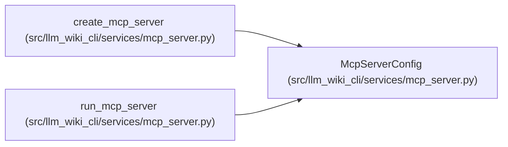

# McpServerConfig

**Location:** `src/llm_wiki_cli/services/mcp_server.py:240`
**Kind:** Class
**Bases:** —
**Module:** [mcp_server](../modules/mcp_server.md)

**Decorators:** `@dataclass(frozen=True)`

## Description

_Auto-generated from `McpServerConfig` in `src/llm_wiki_cli/services/mcp_server.py`._

## Attributes

| Name | Type | Default | Description |
|------|------|---------|-------------|
| `src_dir` | `str` | `'.'` | — |
| `wiki_dir` | `str` | `'docs/llm_wiki'` | — |
| `transport` | `str` | `'stdio'` | — |
| `host` | `str` | `'127.0.0.1'` | — |
| `port` | `int` | `8765` | — |
| `path` | `str` | `'/mcp'` | — |
| `allowed_origins` | `tuple[str, ...]` | `field(default_factory=tuple)` | — |
| `source_selection` | `str \| None` | `None` | — |
| `allow_external_src` | `bool` | `False` | — |
| `counter` | `TokenCounter \| None` | `None` | — |
| `tokenizer` | `str \| None` | `None` | — |
| `workflow_policy` | `WorkflowPolicy \| None` | `None` | — |
| `workflow_profile` | `WorkflowProfile \| None` | `None` | — |
| `enable_sessions` | `bool` | `False` | — |
| `max_sessions` | `int` | `8` | — |

## Methods

*No public methods. Inherits from base classes.*

## Relationships

<!-- Auto-generated relationship summary. Do not edit by hand. -->

### Summary

| Module | Methods | Attributes |
|---|---:|---|
| [mcp_server](../modules/mcp_server.md) | 0 | `allow_external_src`, `allowed_origins`, `counter`, `enable_sessions`, `host`, `max_sessions`, `path`, `port`, `source_selection`, `src_dir`, `tokenizer`, `transport` |

### References

| Reference | Kind | Source | Call sites |
|---|---|---|---:|
| `create_mcp_server` | type_reference | [mcp_server](../modules/mcp_server.md) | — |
| `run_mcp_server` | type_reference | [mcp_server](../modules/mcp_server.md) | — |
