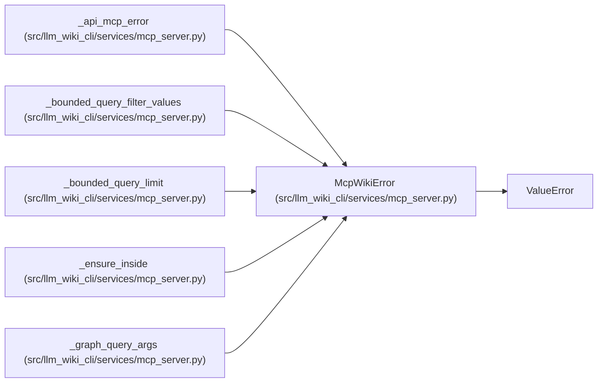

# McpWikiError

**Location:** `src/llm_wiki_cli/services/mcp_server.py:115`
**Kind:** Class
**Bases:** `ValueError`
**Module:** [mcp_server](../modules/mcp_server.md)

## Description

Raised for invalid MCP wiki requests.

## Attributes

*No annotated attributes found.*

## Methods

| Method | Signature | Decorators | Description |
|--------|-----------|------------|-------------|
| `__init__` | `(message: str, *, code: str \| None = None, data: Mapping[str, Any] \| None = None) -> None` | — | — |

## Relationships

<!-- Auto-generated relationship summary. Do not edit by hand. -->

### Summary

| Module | Methods | Attributes |
|---|---:|---|
| [mcp_server](../modules/mcp_server.md) | 1 | — |

### Structure

| Kind | Entity | Module |
|---|---|---|
| Base | `ValueError` | — |

### References

| Reference | Kind | Source |
|---|---|---|
| `_api_mcp_error` | call | [mcp_server](../modules/mcp_server.md) |
| `_api_mcp_error` | type_reference | [mcp_server](../modules/mcp_server.md) |
| `_bounded_query_filter_values` | call | [mcp_server](../modules/mcp_server.md) |
| `_bounded_query_filter_values` | call | [mcp_server](../modules/mcp_server.md) |
| `_bounded_query_filter_values` | call | [mcp_server](../modules/mcp_server.md) |
| `_bounded_query_filter_values` | call | [mcp_server](../modules/mcp_server.md) |
| `_bounded_query_limit` | call | [mcp_server](../modules/mcp_server.md) |
| `_ensure_inside` | call | [mcp_server](../modules/mcp_server.md) |
| `_graph_query_args` | call | [mcp_server](../modules/mcp_server.md) |
| `_graph_query_args` | call | [mcp_server](../modules/mcp_server.md) |
| `_graph_query_args` | call | [mcp_server](../modules/mcp_server.md) |
| `_graph_query_args` | call | [mcp_server](../modules/mcp_server.md) |
