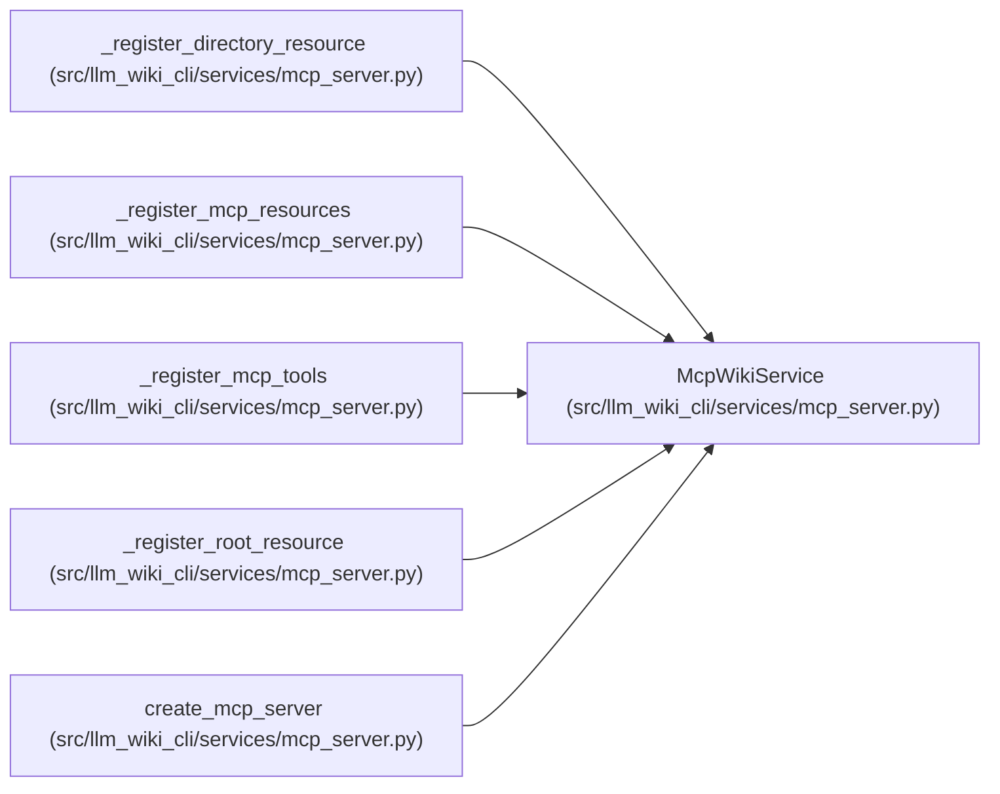

# McpWikiService

**Location:** `src/llm_wiki_cli/services/mcp_server.py:402`
**Kind:** Class
**Bases:** —
**Module:** [mcp_server](../modules/mcp_server.md)

## Description

Pure read/check operations exposed through MCP tools and resources.

## Attributes

*No annotated attributes found.*

## Methods

| Method | Signature | Decorators | Description |
|--------|-----------|------------|-------------|
| `__init__` | `(src_dir: str = '.', wiki_dir: str = 'docs/llm_wiki', *, source_selection: str \| None = None, allow_external_src: bool = False)` | — | — |
| `_assert_source_selection_pin_current` | `() -> SourceSelectionPolicy \| None` | — | — |
| `_assert_source_selection_current` | `() -> SourceSnapshot` | — | — |
| `_source_selection_options` | `() -> _SourceSelectionOptions` | — | — |
| `_external_source_options` | `() -> _ExternalSourceOptions` | — | — |
| `get_entity` | `(entity_id: str) -> dict` | — | — |
| `get_module` | `(module_id_or_source_path: str) -> dict` | — | — |
| `get_flow` | `(flow_id: str) -> dict` | — | — |
| `get_architecture_page` | `(page: str) -> dict` | — | — |
| `query_graph` | `(query: Mapping[str, object]) -> dict` | — | — |
| `query_documentation` | `(request: Mapping[str, Any]) -> dict` | — | Dispatch an exact bounded query through the shared API contract. |
| `get_concept` | `(locator_or_exact_route: str, limit: int = 20) -> dict` | — | Return one concept by current coordinate, durable UID, or alias. |
| `related_concepts` | `(locator_or_exact_route: str, direction: str = 'both', kinds: list[str] \| None = None, limit: int = 20) -> dict` | — | Return bounded relationships for one exact concept identity. |
| `list_concept_sections` | `(locator_or_exact_route: str, ownership: str \| None = None, limit: int = 20) -> dict` | — | Return bounded document-order sections for one exact concept. |
| `traverse_typed_graph` | `(locator_or_exact_route: str, direction: str = 'both', kinds: list[str] \| None = None, origins: list[str] \| None = None, resolutions: list[str] \| None = None, include_evidence: bool = False, limit: int = 20) -> dict` | — | Traverse bounded persisted typed relationships for one concept. |
| `explain_evidence` | `(locator_or_exact_route: str, limit: int = 20) -> dict` | — | Return bounded evidence for one exact concept identity. |
| `search_wiki` | `(query: str, kinds: list[str] \| None = None, limit: int = 20) -> dict` | — | — |
| `get_context` | `(budget_tokens: int = 32000, focus: list[str] \| None = None, format: str = 'markdown', filters: dict \| None = None, prefer_fresh: bool = False, knowledge_mode: KnowledgeMode \| None = None) -> dict` | — | — |
| `get_context_packet` | `(budget_tokens: int = 32000, focus: list[str] \| None = None, format: str = 'json', filters: dict \| None = None, prefer_fresh: bool = False, if_packet_id: str \| None = None, knowledge_mode: KnowledgeMode \| None = None) -> dict` | — | Return a fresh qualified packet or an unchanged cache marker. |
| `check_wiki` | `(strict: bool = False, format: str = 'json', knowledge_drift_report: bool = False) -> dict` | — | — |
| `get_status` | `() -> dict` | — | — |
| `_run_documentation_query` | `(method_name: str, value: str, *, limit: int, **query_options) -> dict` | — | — |
| `read_resource` | `(uri: str) -> dict` | — | — |
| `list_resources` | `() -> list[dict]` | — | — |
| `_resolve_module_page_id` | `(value: str, *, source_snapshot: SourceSnapshot) -> str` | — | — |
| `_page_for` | `(kind: str, page_id: str) -> WikiPage` | — | — |
| `_page_from_uri` | `(uri: str) -> WikiPage` | — | — |
| `_read_page_result` | `(page: WikiPage) -> dict` | — | — |
| `_iter_pages` | `(kinds: set[str])` | — | — |

## Relationships

<!-- Auto-generated relationship summary. Do not edit by hand. -->

### Summary

| Module | Methods | Attributes |
|---|---:|---|
| [mcp_server](../modules/mcp_server.md) | 29 | — |

### References

| Reference | Kind | Source | Call sites |
|---|---|---|---:|
| `_register_directory_resource` | type_reference | [mcp_server](../modules/mcp_server.md) | — |
| `_register_mcp_resources` | type_reference | [mcp_server](../modules/mcp_server.md) | — |
| `_register_mcp_tools` | type_reference | [mcp_server](../modules/mcp_server.md) | — |
| `_register_root_resource` | type_reference | [mcp_server](../modules/mcp_server.md) | — |
| `create_mcp_server` | call | [mcp_server](../modules/mcp_server.md) | 1 |
