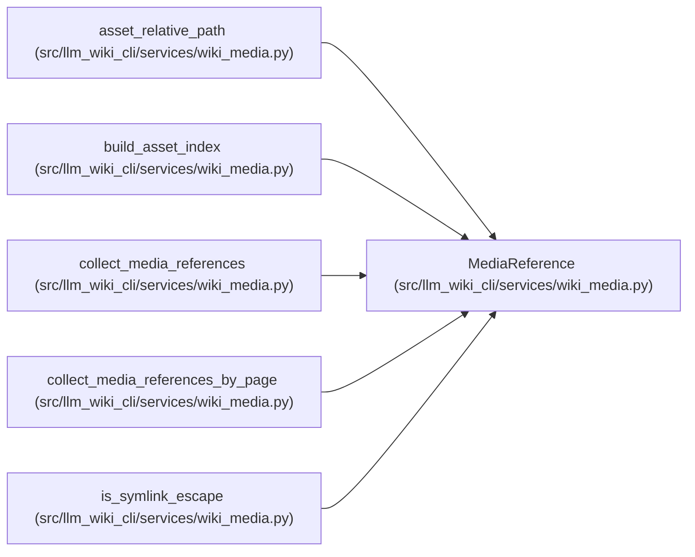

# MediaReference

**Location:** `src/llm_wiki_cli/services/wiki_media.py:40`
**Kind:** Class
**Bases:** —
**Module:** [wiki_media](../modules/wiki_media.md)

**Decorators:** `@dataclass(frozen=True)`

## Description

_Auto-generated from `MediaReference` in `src/llm_wiki_cli/services/wiki_media.py`._

## Attributes

| Name | Type | Default | Description |
|------|------|---------|-------------|
| `page_path` | `Path` | *required* | — |
| `page_rel` | `str` | *required* | — |
| `raw_target` | `str` | *required* | — |
| `target` | `str` | *required* | — |
| `media_type` | `str` | *required* | — |
| `source` | `str` | *required* | — |
| `alt_text` | `Optional[str]` | `None` | — |
| `requires_alt` | `bool` | `False` | — |

## Methods

*No public methods. Inherits from base classes.*

## Relationships

<!-- Auto-generated relationship summary. Do not edit by hand. -->

### Summary

| Module | Methods | Attributes |
|---|---:|---|
| [wiki_media](../modules/wiki_media.md) | 0 | `alt_text`, `media_type`, `page_path`, `page_rel`, `raw_target`, `requires_alt`, `source`, `target` |

### References

| Reference | Kind | Source | Call sites |
|---|---|---|---:|
| `asset_relative_path` | type_reference | [wiki_media](../modules/wiki_media.md) | — |
| `build_asset_index` | type_reference | [wiki_media](../modules/wiki_media.md) | — |
| `collect_media_references` | call | [wiki_media](../modules/wiki_media.md) | 3 |
| `collect_media_references` | type_reference | [wiki_media](../modules/wiki_media.md) | — |
| `collect_media_references_by_page` | type_reference | [wiki_media](../modules/wiki_media.md) | — |
| `is_symlink_escape` | type_reference | [wiki_media](../modules/wiki_media.md) | — |
