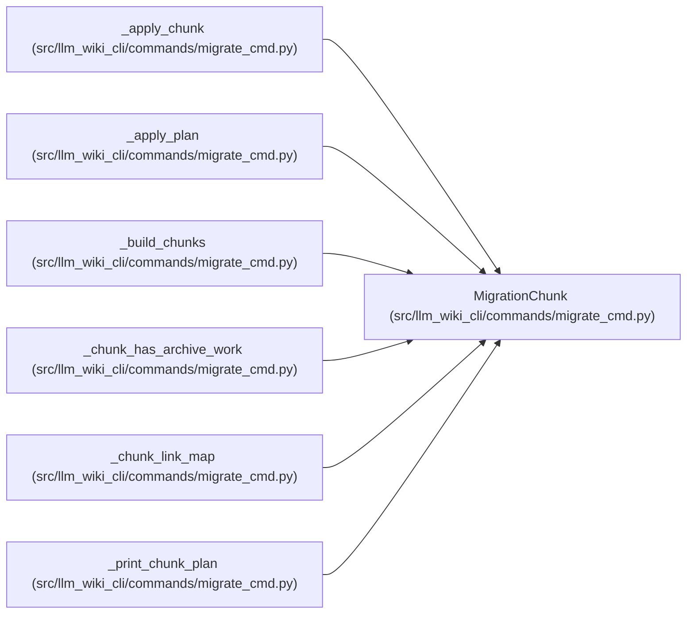

# MigrationChunk

**Location:** `src/llm_wiki_cli/commands/migrate_cmd.py:169`
**Kind:** Class
**Bases:** —
**Module:** [migrate_cmd](../modules/migrate_cmd.md)

**Decorators:** `@dataclass(frozen=True)`

## Description

A bounded subset of currently pending migration work.

## Attributes

| Name | Type | Default | Description |
|------|------|---------|-------------|
| `number` | `int` | *required* | — |
| `total` | `int` | *required* | — |
| `targets` | `list[TargetPage]` | *required* | — |
| `unmatched` | `list[ExistingPage]` | *required* | — |
| `include_finalizers` | `bool` | `False` | — |

## Methods

| Method | Signature | Decorators | Description |
|--------|-----------|------------|-------------|
| `page_operations` | `() -> int` | `@property` | — |

## Relationships

<!-- Auto-generated relationship summary. Do not edit by hand. -->

### Summary

| Module | Methods | Attributes |
|---|---:|---|
| [migrate_cmd](../modules/migrate_cmd.md) | 1 | `include_finalizers`, `number`, `targets`, `total`, `unmatched` |

### References

| Reference | Kind | Source | Call sites |
|---|---|---|---:|
| `_apply_chunk` | type_reference | [migrate_cmd](../modules/migrate_cmd.md) | — |
| `_apply_plan` | call | [migrate_cmd](../modules/migrate_cmd.md) | 1 |
| `_build_chunks` | call | [migrate_cmd](../modules/migrate_cmd.md) | 2 |
| `_build_chunks` | type_reference | [migrate_cmd](../modules/migrate_cmd.md) | — |
| `_chunk_has_archive_work` | type_reference | [migrate_cmd](../modules/migrate_cmd.md) | — |
| `_chunk_link_map` | type_reference | [migrate_cmd](../modules/migrate_cmd.md) | — |
| `_print_chunk_plan` | type_reference | [migrate_cmd](../modules/migrate_cmd.md) | — |
