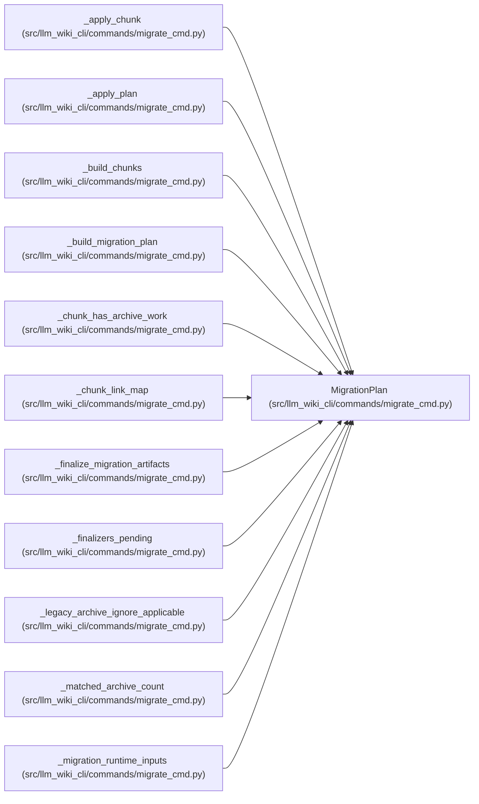

# MigrationPlan

**Location:** `src/llm_wiki_cli/commands/migrate_cmd.py:141`
**Kind:** Class
**Bases:** —
**Module:** [migrate_cmd](../modules/migrate_cmd.md)

**Decorators:** `@dataclass`

## Description

Computed migration operations, shared by apply and dry-run paths.

## Attributes

| Name | Type | Default | Description |
|------|------|---------|-------------|
| `archive_name` | `str` | *required* | — |
| `targets` | `list[TargetPage]` | *required* | — |
| `matches` | `dict[str, list[ExistingPage]]` | `field(default_factory=dict)` | — |
| `unmatched` | `list[ExistingPage]` | `field(default_factory=list)` | — |
| `link_map` | `dict[str, str]` | `field(default_factory=dict)` | — |
| `page_link_maps` | `dict[str, dict[str, str]]` | `field(default_factory=dict)` | — |
| `index_content` | `str` | `''` | — |
| `manifest` | `SyncManifest \| None` | `None` | — |
| `inventory` | `dict` | `field(default_factory=dict)` | — |
| `source_snapshot` | `SourceSnapshot \| None` | `None` | — |
| `module_page_map` | `dict[str, str]` | `field(default_factory=dict)` | — |
| `entity_occurrence_page_map` | `dict[tuple[str, str, int], str]` | `field(default_factory=dict)` | — |
| `inventory_result` | `InventoryResult \| None` | `None` | — |
| `regenerated_structural_page_paths` | `set[str]` | `field(default_factory=set)` | — |
| `repository_evidence` | `RepositoryEvidence \| None` | `None` | — |
| `governance_moves` | `dict[str, str]` | `field(default_factory=dict)` | — |
| `governance_enabled` | `bool` | `False` | — |
| `governance_uid_reuses` | `int` | `0` | — |
| `governance_new_allocations` | `int` | `0` | — |
| `governance_ambiguous_moves` | `int` | `0` | — |

## Methods

*No public methods. Inherits from base classes.*

## Relationships

<!-- Auto-generated relationship summary. Do not edit by hand. -->

### Summary

| Module | Methods | Attributes |
|---|---:|---|
| [migrate_cmd](../modules/migrate_cmd.md) | 0 | `archive_name`, `entity_occurrence_page_map`, `governance_ambiguous_moves`, `governance_enabled`, `governance_moves`, `governance_new_allocations`, `governance_uid_reuses`, `index_content`, `inventory`, `inventory_result`, `link_map`, `manifest` |

### References

| Reference | Kind | Source |
|---|---|---|
| `_apply_chunk` | type_reference | [migrate_cmd](../modules/migrate_cmd.md) |
| `_apply_plan` | type_reference | [migrate_cmd](../modules/migrate_cmd.md) |
| `_build_chunks` | type_reference | [migrate_cmd](../modules/migrate_cmd.md) |
| `_build_migration_plan` | call | [migrate_cmd](../modules/migrate_cmd.md) |
| `_build_migration_plan` | type_reference | [migrate_cmd](../modules/migrate_cmd.md) |
| `_chunk_has_archive_work` | type_reference | [migrate_cmd](../modules/migrate_cmd.md) |
| `_chunk_link_map` | type_reference | [migrate_cmd](../modules/migrate_cmd.md) |
| `_finalize_migration_artifacts` | type_reference | [migrate_cmd](../modules/migrate_cmd.md) |
| `_finalizers_pending` | type_reference | [migrate_cmd](../modules/migrate_cmd.md) |
| `_legacy_archive_ignore_applicable` | type_reference | [migrate_cmd](../modules/migrate_cmd.md) |
| `_matched_archive_count` | type_reference | [migrate_cmd](../modules/migrate_cmd.md) |
| `_migration_runtime_inputs` | type_reference | [migrate_cmd](../modules/migrate_cmd.md) |
