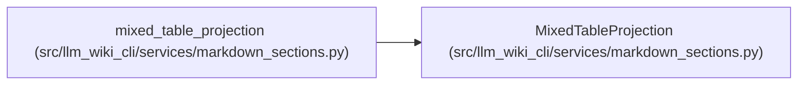

# MixedTableProjection

**Location:** `src/llm_wiki_cli/services/markdown_sections.py:188`
**Kind:** Class
**Bases:** —
**Module:** [markdown_sections](../modules/markdown_sections.md)

**Decorators:** `@dataclass(frozen=True)`

## Description

Separate structural and semantic commitments for one mixed section.

## Attributes

| Name | Type | Default | Description |
|------|------|---------|-------------|
| `structural_projection` | `dict[str, object]` | *required* | — |
| `semantic_projection` | `dict[str, object]` | *required* | — |
| `structural_hash` | `str` | *required* | — |
| `semantic_hash` | `str` | *required* | — |
| `description_cells` | `tuple[TableDescriptionCell, ...]` | *required* | — |

## Methods

*No public methods. Inherits from base classes.*

## Relationships

<!-- Auto-generated relationship summary. Do not edit by hand. -->

### Summary

| Module | Methods | Attributes |
|---|---:|---|
| [markdown_sections](../modules/markdown_sections.md) | 0 | `description_cells`, `semantic_hash`, `semantic_projection`, `structural_hash`, `structural_projection` |

### References

| Reference | Kind | Source |
|---|---|---|
| `mixed_table_projection` | call | [markdown_sections](../modules/markdown_sections.md) |
| `mixed_table_projection` | type_reference | [markdown_sections](../modules/markdown_sections.md) |
