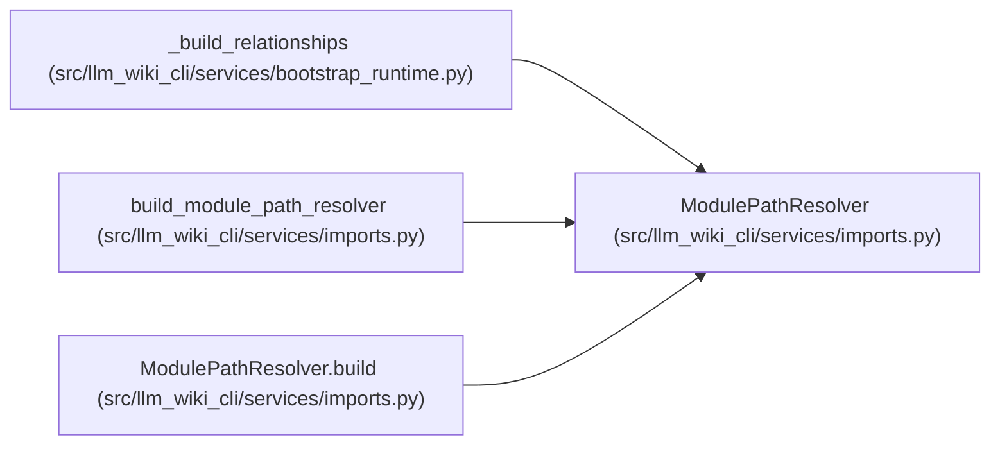

# ModulePathResolver

**Location:** `src/llm_wiki_cli/services/imports.py:41`
**Kind:** Class
**Bases:** —
**Module:** [imports](../modules/imports.md)

**Decorators:** `@dataclass(frozen=True)`

## Description

Indexed module import resolver for a fixed inventory.

## Attributes

| Name | Type | Default | Description |
|------|------|---------|-------------|
| `inventory` | `dict` | *required* | — |
| `lookup` | `dict[str, frozenset[str]]` | *required* | — |
| `language_lookup` | `dict[str, dict[str, frozenset[str]]]` | *required* | — |
| `go_package_lookup` | `dict[str, frozenset[str]]` | *required* | — |
| `haskell_module_lookup` | `dict[str, frozenset[str]]` | *required* | — |
| `go_module_scopes` | `tuple[_GoModuleScope, ...]` | *required* | — |
| `ts_path_aliases` | `tuple[_TsPathAliasRule, ...]` | *required* | — |

## Methods

| Method | Signature | Decorators | Description |
|--------|-----------|------------|-------------|
| `build` | `(inventory: dict, project_root: str \| Path \| None = None, *, source_snapshot: SourceSnapshot \| None = None) -> ModulePathResolver` | `@classmethod` | — |
| `candidates` | `(module: str, importer_filepath: str) -> set[str]` | — | — |
| `import_candidates` | `(module: str, name: str, importer_filepath: str, *, import_type: str \| None = None) -> set[str]` | — | Resolve one extractor import record to its internal module files. |
| `_candidate_matches` | `(candidate_stems: set[str], importer_filepath: str) -> set[str]` | — | — |
| `_lookup_for_importer` | `(importer_filepath: str) -> dict[str, frozenset[str]]` | — | — |
| `typescript_path_alias_matched` | `(module: str, importer_filepath: str) -> bool` | — | Return true when *module* matches the importer's nearest tsconfig paths. |
| `_is_go_importer` | `(importer_filepath: str) -> bool` | — | — |
| `_is_haskell_importer` | `(importer_filepath: str) -> bool` | — | — |
| `_is_typescript_importer` | `(importer_filepath: str) -> bool` | — | — |
| `_go_candidates` | `(module: str, importer_filepath: str) -> set[str]` | — | — |
| `_nearest_go_scope` | `(importer_filepath: str) -> _GoModuleScope \| None` | — | — |
| `_go_scope_matches` | `(module: str, scope: _GoModuleScope) -> set[str]` | — | — |
| `_haskell_candidates` | `(module: str) -> set[str]` | — | — |
| `_typescript_alias_candidate_stems` | `(module: str, importer_filepath: str) -> tuple[bool, set[str]]` | — | — |

## Relationships

<!-- Auto-generated relationship summary. Do not edit by hand. -->

### Summary

| Module | Methods | Attributes |
|---|---:|---|
| [imports](../modules/imports.md) | 14 | `go_module_scopes`, `go_package_lookup`, `haskell_module_lookup`, `inventory`, `language_lookup`, `lookup`, `ts_path_aliases` |

### References

| Reference | Kind | Source |
|---|---|---|
| `_build_relationships` | type_reference | [bootstrap_runtime](../modules/bootstrap_runtime.md) |
| `build_module_path_resolver` | type_reference | [imports](../modules/imports.md) |
| `ModulePathResolver.build` | type_reference | [imports](../modules/imports.md) |
