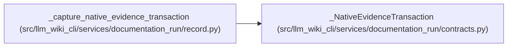

# _NativeEvidenceTransaction

**Location:** `src/llm_wiki_cli/services/documentation_run/contracts.py:939`
**Kind:** Class
**Bases:** —
**Module:** [documentation_run_contracts](../modules/documentation_run_contracts.md)

**Decorators:** `@dataclass(frozen=True)`

## Description

Captured controller state for refresh plus evidence reconciliation.

## Attributes

| Name | Type | Default | Description |
|------|------|---------|-------------|
| `wiki_root` | `Path` | *required* | — |
| `artifact_snapshot` | `dict[str, bytes \| None]` | *required* | — |
| `control_snapshot` | `dict[Path, bytes \| None]` | *required* | — |
| `run_state` | `dict[str, Any]` | *required* | — |

## Methods

*No public methods. Inherits from base classes.*

## Relationships

<!-- Auto-generated relationship summary. Do not edit by hand. -->

### Summary

| Module | Methods | Attributes |
|---|---:|---|
| [documentation_run_contracts](../modules/documentation_run_contracts.md) | 0 | `artifact_snapshot`, `control_snapshot`, `run_state`, `wiki_root` |

### References

| Reference | Kind | Source | Call sites |
|---|---|---|---:|
| `_capture_native_evidence_transaction` | call | [record](../modules/record.md) | 1 |
