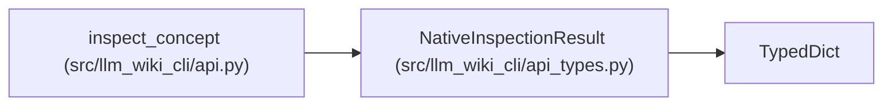

# NativeInspectionResult

**Location:** `src/llm_wiki_cli/api_types.py:414`
**Kind:** Class
**Bases:** `TypedDict`
**Module:** [api_types](../modules/api_types.md)

## Description

Bounded component results sharing one source/wiki read scope.

## Attributes

| Name | Type | Presence | Description |
|------|------|----------|-------------|
| `schema_version` | `str` | *required* | — |
| `read_scope` | `str` | *required* | — |
| `cost` | `QueryCostDisclosure` | *required* | — |
| `concept` | `ConceptResult` | *required* | — |
| `graph` | `TypedGraphTraversalResult` | *required* | — |
| `sections` | `ConceptSectionsResult` | *required* | — |
| `coverage` | `KnowledgeCoverageResult` | *required* | — |
| `limits` | `dict[str, int]` | *required* | — |
| `truncated` | `bool` | *required* | — |

## Methods

*No public methods. Inherits from base classes.*

## Relationships

<!-- Auto-generated relationship summary. Do not edit by hand. -->

### Summary

| Module | Methods | Attributes |
|---|---:|---|
| [api_types](../modules/api_types.md) | 0 | `concept`, `cost`, `coverage`, `graph`, `limits`, `read_scope`, `schema_version`, `sections`, `truncated` |

### Structure

| Kind | Entity | Module |
|---|---|---|
| Base | `TypedDict` | — |

### References

| Reference | Kind | Source | Call sites |
|---|---|---|---:|
| `inspect_concept` | type_reference | [api](../modules/api.md) | — |
