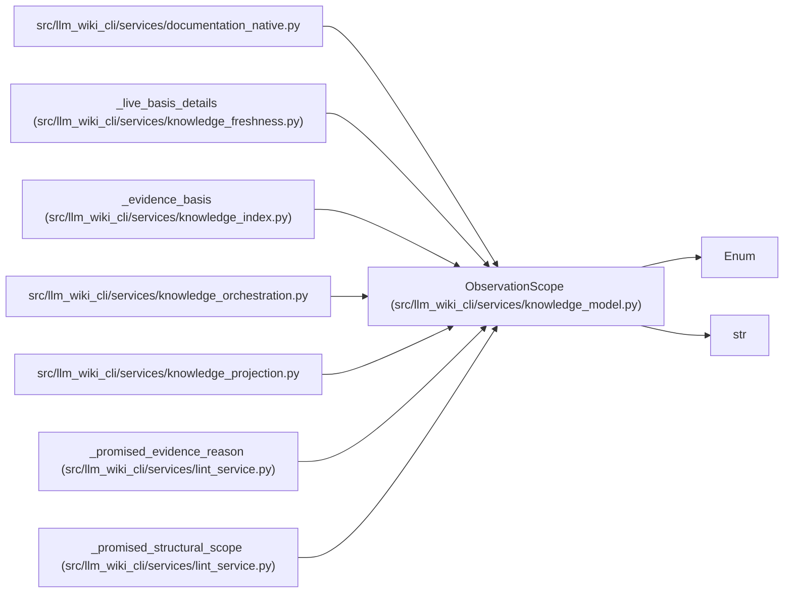

# ObservationScope

**Location:** `src/llm_wiki_cli/services/knowledge_model.py:220`
**Kind:** Enum
**Bases:** `str`, `Enum`
**Module:** [knowledge_model](../modules/knowledge_model.md)

## Description

_Auto-generated from `ObservationScope` in `src/llm_wiki_cli/services/knowledge_model.py`._

## Attributes

| Name | Declared value | Description |
|------|-------|-------------|
| `UNKNOWN` | `'unknown'` | — |
| `MODULE` | `'module'` | — |
| `ENTITY` | `'entity'` | — |
| `INFRASTRUCTURE` | `'infrastructure'` | — |
| `AGGREGATE` | `'aggregate'` | — |

## Methods

*No public methods. Inherits from base classes.*

## Relationships

<!-- Auto-generated relationship summary. Do not edit by hand. -->

### Summary

| Module | Methods | Attributes |
|---|---:|---|
| [knowledge_model](../modules/knowledge_model.md) | 0 | `AGGREGATE`, `ENTITY`, `INFRASTRUCTURE`, `MODULE`, `UNKNOWN` |

### Structure

| Kind | Entity | Module |
|---|---|---|
| Base | `Enum` | — |
| Base | `str` | — |

### References

| Reference | Kind | Source |
|---|---|---|
| `documentation_native` | import | [documentation_native](../modules/documentation_native.md) |
| `_live_basis_details` | call | [knowledge_freshness](../modules/knowledge_freshness.md) |
| `_evidence_basis` | call | [knowledge_index](../modules/knowledge_index.md) |
| `knowledge_orchestration` | import | [knowledge_orchestration](../modules/knowledge_orchestration.md) |
| `knowledge_projection` | import | [knowledge_projection](../modules/knowledge_projection.md) |
| `_promised_evidence_reason` | type_reference | [lint_service](../modules/lint_service.md) |
| `_promised_structural_scope` | type_reference | [lint_service](../modules/lint_service.md) |
