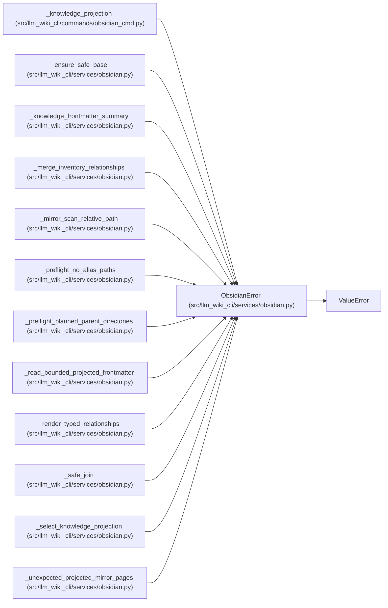

# ObsidianError

**Location:** `src/llm_wiki_cli/services/obsidian.py:106`
**Kind:** Class
**Bases:** `ValueError`
**Module:** [obsidian](../modules/obsidian.md)

## Description

Raised for invalid Obsidian export/check requests.

## Attributes

*No annotated attributes found.*

## Methods

*No public methods. Inherits from base classes.*

## Relationships

<!-- Auto-generated relationship summary. Do not edit by hand. -->

### Summary

| Module | Methods | Attributes |
|---|---:|---|
| [obsidian](../modules/obsidian.md) | 0 | — |

### Structure

| Kind | Entity | Module |
|---|---|---|
| Base | `ValueError` | — |

### References

| Reference | Kind | Source | Call sites |
|---|---|---|---:|
| `_knowledge_projection` | call | [obsidian_cmd](../modules/obsidian_cmd.md) | 3 |
| `_ensure_safe_base` | call | [obsidian](../modules/obsidian.md) | 1 |
| `_knowledge_frontmatter_summary` | call | [obsidian](../modules/obsidian.md) | 1 |
| `_merge_inventory_relationships` | call | [obsidian](../modules/obsidian.md) | 1 |
| `_mirror_scan_relative_path` | call | [obsidian](../modules/obsidian.md) | 1 |
| `_preflight_no_alias_paths` | call | [obsidian](../modules/obsidian.md) | 1 |
| `_preflight_planned_parent_directories` | call | [obsidian](../modules/obsidian.md) | 3 |
| `_read_bounded_projected_frontmatter` | call | [obsidian](../modules/obsidian.md) | 5 |
| `_render_typed_relationships` | call | [obsidian](../modules/obsidian.md) | 1 |
| `_safe_join` | call | [obsidian](../modules/obsidian.md) | 2 |
| `_select_knowledge_projection` | call | [obsidian](../modules/obsidian.md) | 4 |
| `_unexpected_projected_mirror_pages` | call | [obsidian](../modules/obsidian.md) | 13 |

> References: showing 12 of 18 logical references; 6 omitted by the 12-row generated summary limit.
