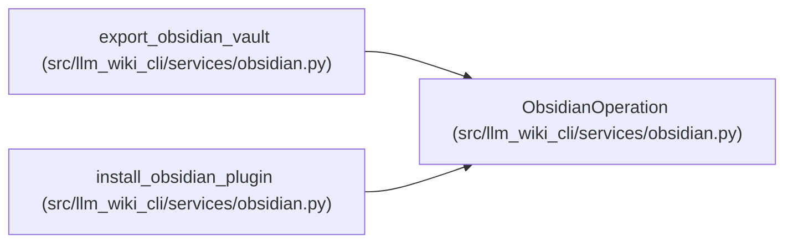

# ObsidianOperation

**Location:** `src/llm_wiki_cli/services/obsidian.py:165`
**Kind:** Class
**Bases:** —
**Module:** [obsidian](../modules/obsidian.md)

**Decorators:** `@dataclass`

## Description

_Auto-generated from `ObsidianOperation` in `src/llm_wiki_cli/services/obsidian.py`._

## Attributes

| Name | Type | Default | Description |
|------|------|---------|-------------|
| `action` | `str` | *required* | — |
| `path` | `str` | *required* | — |
| `message` | `str` | `''` | — |

## Methods

*No public methods. Inherits from base classes.*

## Relationships

<!-- Auto-generated relationship summary. Do not edit by hand. -->

### Summary

| Module | Methods | Attributes |
|---|---:|---|
| [obsidian](../modules/obsidian.md) | 0 | `action`, `message`, `path` |

### References

| Reference | Kind | Source |
|---|---|---|
| `export_obsidian_vault` | call | [obsidian](../modules/obsidian.md) |
| `export_obsidian_vault` | call | [obsidian](../modules/obsidian.md) |
| `export_obsidian_vault` | call | [obsidian](../modules/obsidian.md) |
| `export_obsidian_vault` | call | [obsidian](../modules/obsidian.md) |
| `export_obsidian_vault` | call | [obsidian](../modules/obsidian.md) |
| `install_obsidian_plugin` | call | [obsidian](../modules/obsidian.md) |
