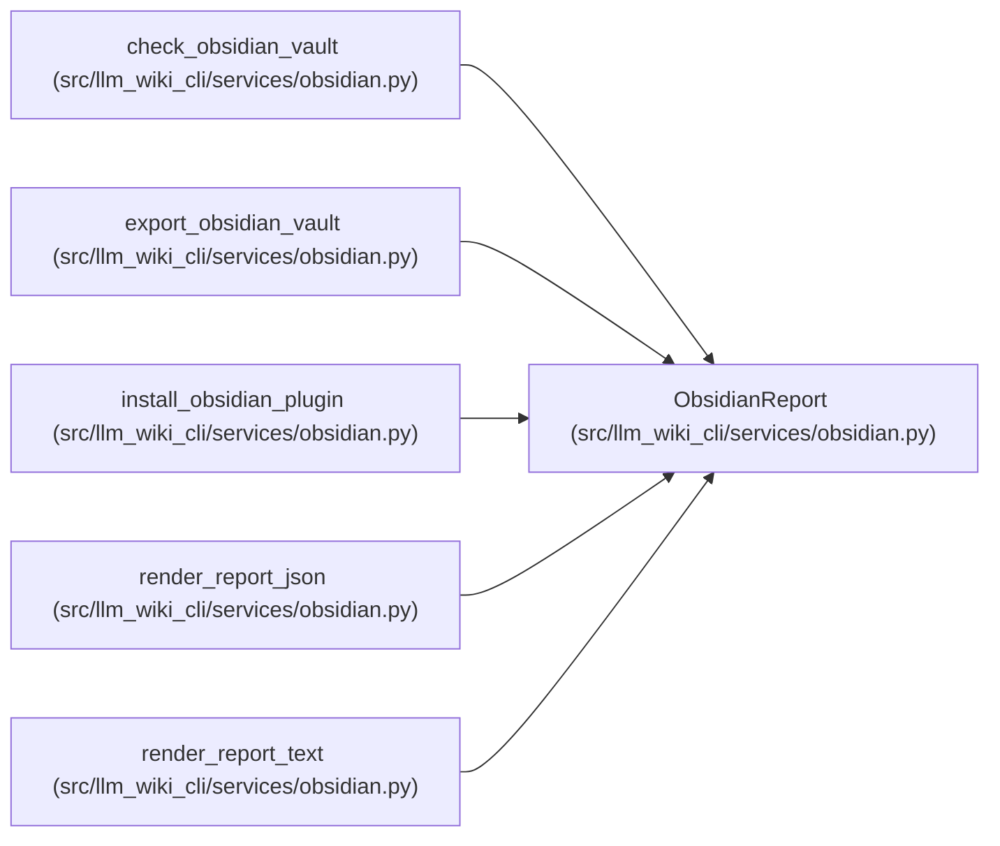

# ObsidianReport

**Location:** `src/llm_wiki_cli/services/obsidian.py:172`
**Kind:** Class
**Bases:** —
**Module:** [obsidian](../modules/obsidian.md)

**Decorators:** `@dataclass`

## Description

_Auto-generated from `ObsidianReport` in `src/llm_wiki_cli/services/obsidian.py`._

## Attributes

| Name | Type | Default | Description |
|------|------|---------|-------------|
| `ok` | `bool` | `True` | — |
| `dry_run` | `bool` | `False` | — |
| `wiki_dir` | `str` | `''` | — |
| `vault_dir` | `str` | `''` | — |
| `mirror_root` | `str` | `MIRROR_ROOT` | — |
| `page_count` | `int` | `0` | — |
| `operations` | `list[ObsidianOperation]` | `field(default_factory=list)` | — |
| `issues` | `list[dict[str, str]]` | `field(default_factory=list)` | — |
| `freshness` | `str \| None` | `None` | — |

## Methods

| Method | Signature | Decorators | Description |
|--------|-----------|------------|-------------|
| `to_dict` | `() -> dict[str, Any]` | — | — |

## Relationships

<!-- Auto-generated relationship summary. Do not edit by hand. -->

### Summary

| Module | Methods | Attributes |
|---|---:|---|
| [obsidian](../modules/obsidian.md) | 1 | `dry_run`, `freshness`, `issues`, `mirror_root`, `ok`, `operations`, `page_count`, `vault_dir`, `wiki_dir` |

### References

| Reference | Kind | Source | Call sites |
|---|---|---|---:|
| `check_obsidian_vault` | call | [obsidian](../modules/obsidian.md) | 1 |
| `check_obsidian_vault` | type_reference | [obsidian](../modules/obsidian.md) | — |
| `export_obsidian_vault` | call | [obsidian](../modules/obsidian.md) | 1 |
| `export_obsidian_vault` | type_reference | [obsidian](../modules/obsidian.md) | — |
| `install_obsidian_plugin` | call | [obsidian](../modules/obsidian.md) | 1 |
| `install_obsidian_plugin` | type_reference | [obsidian](../modules/obsidian.md) | — |
| `render_report_json` | type_reference | [obsidian](../modules/obsidian.md) | — |
| `render_report_text` | type_reference | [obsidian](../modules/obsidian.md) | — |
