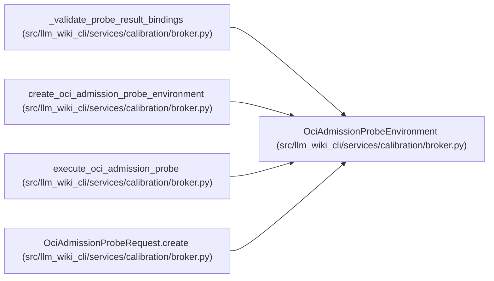

# OciAdmissionProbeEnvironment

**Location:** `src/llm_wiki_cli/services/calibration/broker.py:1458`
**Kind:** Class
**Bases:** —
**Module:** [broker](../modules/broker.md)

## Description

Live host evidence required to execute one admission probe.

## Attributes

*No annotated attributes found.*

## Methods

| Method | Signature | Decorators | Description |
|--------|-----------|------------|-------------|
| `__init__` | `(*, sentinels: tuple[OciProbeSentinel, ...], sentinel_identities: Mapping[str, tuple[int, int, int, int]], canary: _LocalEgressCanary) -> None` | — | — |
| `post_control_network_connections` | `() -> int` | `@property` | — |
| `assert_ready` | `() -> None` | — | — |
| `validate_request` | `(request: 'OciAdmissionProbeRequest') -> None` | — | — |

## Relationships

<!-- Auto-generated relationship summary. Do not edit by hand. -->

### Summary

| Module | Methods | Attributes |
|---|---:|---|
| [broker](../modules/broker.md) | 4 | — |

### References

| Reference | Kind | Source |
|---|---|---|
| `_validate_probe_result_bindings` | type_reference | [broker](../modules/broker.md) |
| `create_oci_admission_probe_environment` | call | [broker](../modules/broker.md) |
| `create_oci_admission_probe_environment` | type_reference | [broker](../modules/broker.md) |
| `execute_oci_admission_probe` | type_reference | [broker](../modules/broker.md) |
| `OciAdmissionProbeRequest.create` | type_reference | [broker](../modules/broker.md) |
