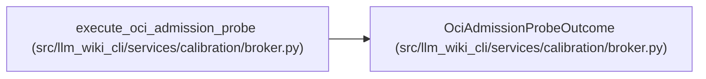

# OciAdmissionProbeOutcome

**Location:** `src/llm_wiki_cli/services/calibration/broker.py:1996`
**Kind:** Class
**Bases:** —
**Module:** [broker](../modules/broker.md)

**Decorators:** `@dataclass(frozen=True)`

## Description

Execution and result evidence for admission; never an authority grant.

## Attributes

| Name | Type | Default | Description |
|------|------|---------|-------------|
| `passed` | `bool` | *required* | — |
| `execution_status` | `str` | *required* | — |
| `request_hash` | `str` | *required* | — |
| `result_hash` | `Optional[str]` | *required* | — |
| `result` | `Optional[OciAdmissionProbeResult]` | *required* | — |
| `process` | `BoundedProcessResult` | *required* | — |
| `command_hash` | `str` | *required* | — |
| `cleanup_status` | `str` | *required* | — |
| `stdout` | `str` | *required* | — |
| `stderr` | `str` | *required* | — |
| `error` | `Optional[str]` | *required* | — |

## Methods

*No public methods. Inherits from base classes.*

## Relationships

<!-- Auto-generated relationship summary. Do not edit by hand. -->

### Summary

| Module | Methods | Attributes |
|---|---:|---|
| [broker](../modules/broker.md) | 0 | `cleanup_status`, `command_hash`, `error`, `execution_status`, `passed`, `process`, `request_hash`, `result`, `result_hash`, `stderr`, `stdout` |

### References

| Reference | Kind | Source |
|---|---|---|
| `execute_oci_admission_probe` | call | [broker](../modules/broker.md) |
| `execute_oci_admission_probe` | type_reference | [broker](../modules/broker.md) |
