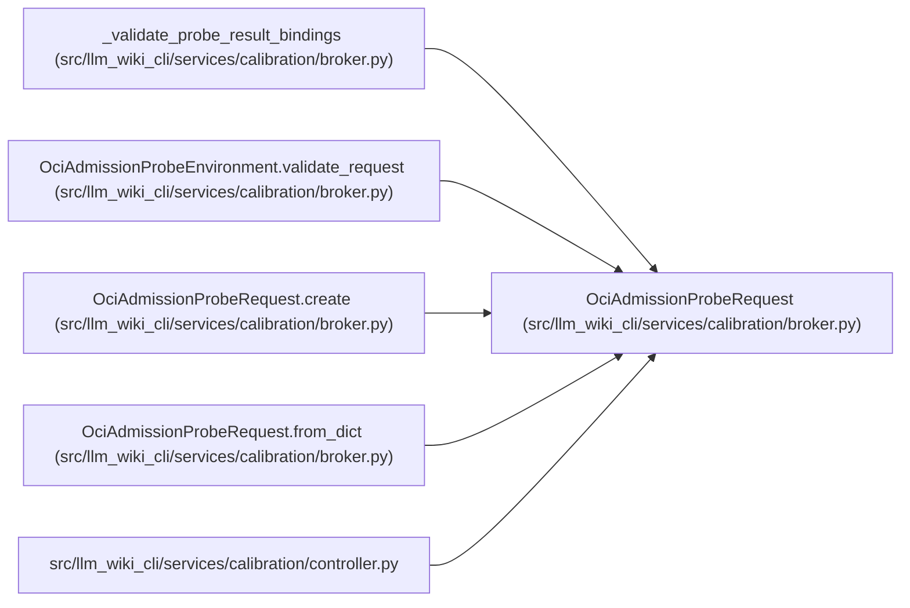

# OciAdmissionProbeRequest

**Location:** `src/llm_wiki_cli/services/calibration/broker.py:1744`
**Kind:** Class
**Bases:** —
**Module:** [broker](../modules/broker.md)

**Decorators:** `@dataclass(frozen=True)`

## Description

Evidence-bound request consumed by the pinned adversarial probe image.

## Attributes

| Name | Type | Default | Description |
|------|------|---------|-------------|
| `schema_version` | `str` | *required* | — |
| `cohort_id` | `str` | *required* | — |
| `probe_id` | `str` | *required* | — |
| `authority_hash` | `str` | *required* | — |
| `required_checks` | `tuple[str, ...]` | *required* | — |
| `filesystem_sentinels` | `tuple[OciProbeSentinel, ...]` | *required* | — |
| `network_canary` | `OciNetworkCanaryBinding` | *required* | — |
| `output_limit_bytes` | `int` | *required* | — |

## Methods

| Method | Signature | Decorators | Description |
|--------|-----------|------------|-------------|
| `__post_init__` | `() -> None` | — | — |
| `request_hash` | `() -> str` | `@property` | — |
| `target_binding` | `(probe: str) -> tuple[str, str]` | — | — |
| `to_dict` | `() -> dict[str, Any]` | — | — |
| `create` | `(*, cohort_id: str, probe_id: str, authority_hash: str, probe_environment: OciAdmissionProbeEnvironment, output_limit_bytes: int) -> 'OciAdmissionProbeRequest'` | `@classmethod` | — |
| `from_dict` | `(payload: Mapping[str, Any]) -> 'OciAdmissionProbeRequest'` | `@classmethod` | — |

## Relationships

<!-- Auto-generated relationship summary. Do not edit by hand. -->

### Summary

| Module | Methods | Attributes |
|---|---:|---|
| [broker](../modules/broker.md) | 6 | `authority_hash`, `cohort_id`, `filesystem_sentinels`, `network_canary`, `output_limit_bytes`, `probe_id`, `required_checks`, `schema_version` |

### References

| Reference | Kind | Source |
|---|---|---|
| `_validate_probe_result_bindings` | type_reference | [broker](../modules/broker.md) |
| `OciAdmissionProbeEnvironment.validate_request` | type_reference | [broker](../modules/broker.md) |
| `OciAdmissionProbeRequest.create` | type_reference | [broker](../modules/broker.md) |
| `OciAdmissionProbeRequest.from_dict` | type_reference | [broker](../modules/broker.md) |
| `controller` | import | [controller](../modules/controller.md) |
