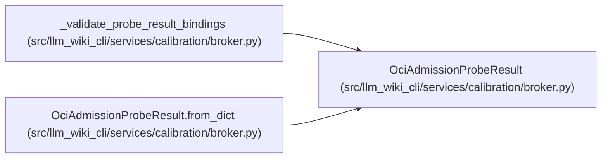

# OciAdmissionProbeResult

**Location:** `src/llm_wiki_cli/services/calibration/broker.py:1910`
**Kind:** Class
**Bases:** —
**Module:** [broker](../modules/broker.md)

**Decorators:** `@dataclass(frozen=True)`

## Description

Strict result emitted by the pinned adversarial probe image.

## Attributes

| Name | Type | Default | Description |
|------|------|---------|-------------|
| `schema_version` | `str` | *required* | — |
| `cohort_id` | `str` | *required* | — |
| `probe_id` | `str` | *required* | — |
| `request_hash` | `str` | *required* | — |
| `image_digest` | `str` | *required* | — |
| `access_events` | `tuple[OciProbeCheck, ...]` | *required* | — |
| `status` | `str` | *required* | — |

## Methods

| Method | Signature | Decorators | Description |
|--------|-----------|------------|-------------|
| `__post_init__` | `() -> None` | — | — |
| `to_dict` | `() -> dict[str, Any]` | — | — |
| `from_dict` | `(payload: Mapping[str, Any]) -> 'OciAdmissionProbeResult'` | `@classmethod` | — |

## Relationships

<!-- Auto-generated relationship summary. Do not edit by hand. -->

### Summary

| Module | Methods | Attributes |
|---|---:|---|
| [broker](../modules/broker.md) | 3 | `access_events`, `cohort_id`, `image_digest`, `probe_id`, `request_hash`, `schema_version`, `status` |

### References

| Reference | Kind | Source | Call sites |
|---|---|---|---:|
| `_validate_probe_result_bindings` | type_reference | [broker](../modules/broker.md) | — |
| `OciAdmissionProbeResult.from_dict` | type_reference | [broker](../modules/broker.md) | — |
