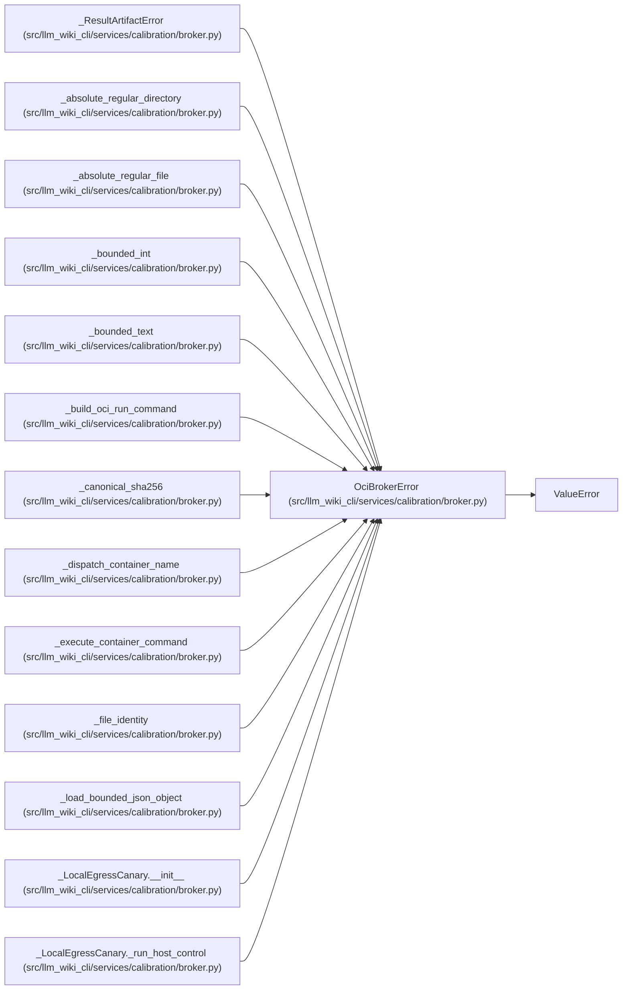

# OciBrokerError

**Location:** `src/llm_wiki_cli/services/calibration/broker.py:133`
**Kind:** Class
**Bases:** `ValueError`
**Module:** [broker](../modules/broker.md)

## Description

Raised when OCI configuration or dispatch evidence is unsafe.

## Attributes

*No annotated attributes found.*

## Methods

*No public methods. Inherits from base classes.*

## Relationships

<!-- Auto-generated relationship summary. Do not edit by hand. -->

### Summary

| Module | Methods | Attributes |
|---|---:|---|
| [broker](../modules/broker.md) | 0 | — |

### Structure

| Kind | Entity | Module |
|---|---|---|
| Base | `ValueError` | — |
| Subclass | `_ResultArtifactError` | [broker](../modules/broker.md) |

### References

| Reference | Kind | Source | Call sites |
|---|---|---|---:|
| `_absolute_regular_directory` | call | [broker](../modules/broker.md) | 3 |
| `_absolute_regular_file` | call | [broker](../modules/broker.md) | 4 |
| `_bounded_int` | call | [broker](../modules/broker.md) | 2 |
| `_bounded_text` | call | [broker](../modules/broker.md) | 2 |
| `_build_oci_run_command` | call | [broker](../modules/broker.md) | 2 |
| `_canonical_sha256` | call | [broker](../modules/broker.md) | 1 |
| `_dispatch_container_name` | call | [broker](../modules/broker.md) | 1 |
| `_execute_container_command` | call | [broker](../modules/broker.md) | 1 |
| `_file_identity` | call | [broker](../modules/broker.md) | 1 |
| `_load_bounded_json_object` | call | [broker](../modules/broker.md) | 2 |
| `_LocalEgressCanary.__init__` | call | [broker](../modules/broker.md) | 3 |
| `_LocalEgressCanary._run_host_control` | call | [broker](../modules/broker.md) | 2 |

> References: showing 12 of 67 logical references; 55 omitted by the 12-row generated summary limit.
