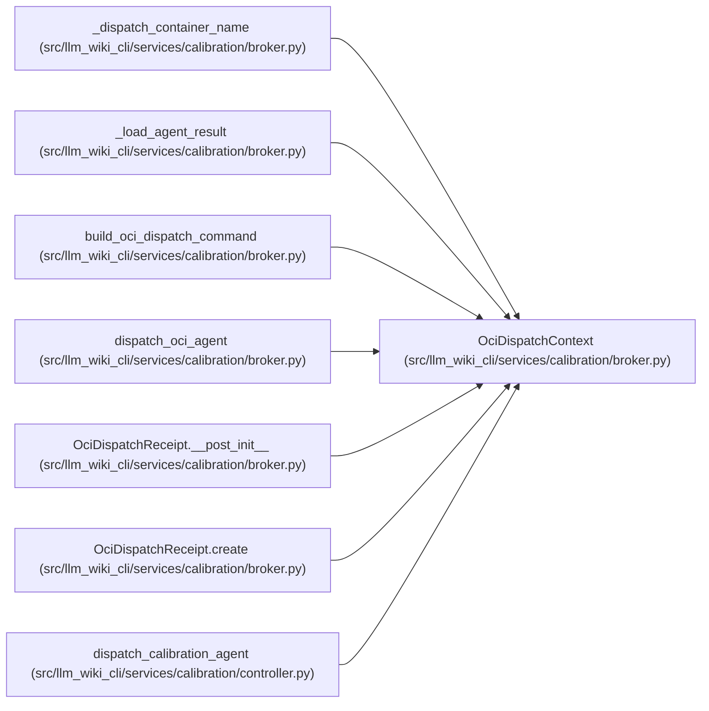

# OciDispatchContext

**Location:** `src/llm_wiki_cli/services/calibration/broker.py:728`
**Kind:** Class
**Bases:** —
**Module:** [broker](../modules/broker.md)

**Decorators:** `@dataclass(frozen=True)`

## Description

Controller-owned frozen value bindings for one agent attempt.

## Attributes

| Name | Type | Default | Description |
|------|------|---------|-------------|
| `cohort_id` | `str` | *required* | — |
| `generation` | `int` | *required* | — |
| `head_transition_hash` | `str` | *required* | — |
| `role` | `str` | *required* | — |
| `attempt` | `int` | *required* | — |
| `packet_id` | `str` | *required* | — |
| `packet_hash` | `str` | *required* | — |
| `authority_hash` | `str` | *required* | — |
| `attestation_hash` | `str` | *required* | — |
| `access_audit_hash` | `str` | *required* | — |
| `idempotency_key` | `str` | *required* | — |

## Methods

| Method | Signature | Decorators | Description |
|--------|-----------|------------|-------------|
| `__post_init__` | `() -> None` | — | — |

## Relationships

<!-- Auto-generated relationship summary. Do not edit by hand. -->

### Summary

| Module | Methods | Attributes |
|---|---:|---|
| [broker](../modules/broker.md) | 1 | `access_audit_hash`, `attempt`, `attestation_hash`, `authority_hash`, `cohort_id`, `generation`, `head_transition_hash`, `idempotency_key`, `packet_hash`, `packet_id`, `role` |

### References

| Reference | Kind | Source |
|---|---|---|
| `_dispatch_container_name` | type_reference | [broker](../modules/broker.md) |
| `_load_agent_result` | type_reference | [broker](../modules/broker.md) |
| `build_oci_dispatch_command` | type_reference | [broker](../modules/broker.md) |
| `dispatch_oci_agent` | type_reference | [broker](../modules/broker.md) |
| `OciDispatchReceipt.__post_init__` | call | [broker](../modules/broker.md) |
| `OciDispatchReceipt.create` | type_reference | [broker](../modules/broker.md) |
| `dispatch_calibration_agent` | call | [controller](../modules/controller.md) |
