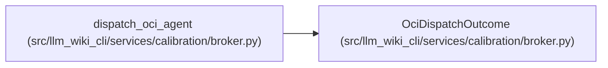

# OciDispatchOutcome

**Location:** `src/llm_wiki_cli/services/calibration/broker.py:1155`
**Kind:** Class
**Bases:** —
**Module:** [broker](../modules/broker.md)

**Decorators:** `@dataclass(frozen=True)`

## Description

Bounded local evidence and a hash-bound receipt returned to the controller.

## Attributes

| Name | Type | Default | Description |
|------|------|---------|-------------|
| `receipt` | `OciDispatchReceipt` | *required* | — |
| `result` | `Optional[Mapping[str, Any]]` | *required* | — |
| `stdout` | `str` | *required* | — |
| `stderr` | `str` | *required* | — |

## Methods

*No public methods. Inherits from base classes.*

## Relationships

<!-- Auto-generated relationship summary. Do not edit by hand. -->

### Summary

| Module | Methods | Attributes |
|---|---:|---|
| [broker](../modules/broker.md) | 0 | `receipt`, `result`, `stderr`, `stdout` |

### References

| Reference | Kind | Source | Call sites |
|---|---|---|---:|
| `dispatch_oci_agent` | call | [broker](../modules/broker.md) | 1 |
| `dispatch_oci_agent` | type_reference | [broker](../modules/broker.md) | — |
