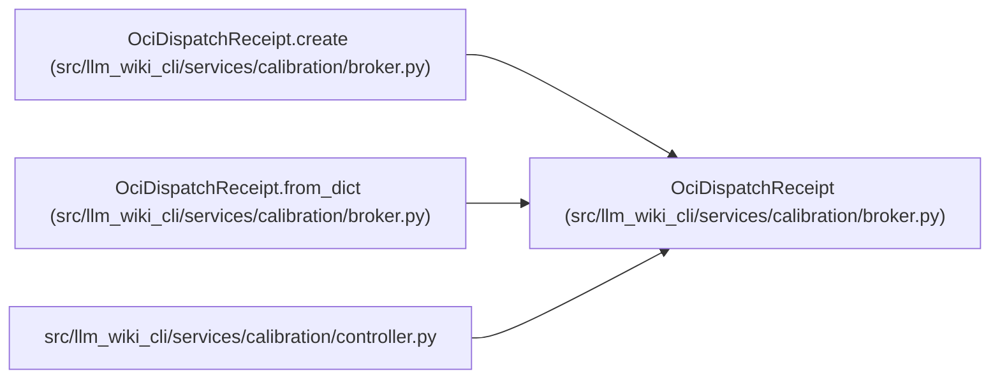

# OciDispatchReceipt

**Location:** `src/llm_wiki_cli/services/calibration/broker.py:830`
**Kind:** Class
**Bases:** —
**Module:** [broker](../modules/broker.md)

**Decorators:** `@dataclass(frozen=True)`

## Description

Application-level hash-bound evidence for one broker attempt.

## Attributes

| Name | Type | Default | Description |
|------|------|---------|-------------|
| `schema_version` | `str` | *required* | — |
| `receipt_id` | `str` | *required* | — |
| `receipt_hash` | `str` | *required* | — |
| `cohort_id` | `str` | *required* | — |
| `generation` | `int` | *required* | — |
| `head_transition_hash` | `str` | *required* | — |
| `role` | `str` | *required* | — |
| `attempt` | `int` | *required* | — |
| `idempotency_key` | `str` | *required* | — |
| `packet_id` | `str` | *required* | — |
| `packet_hash` | `str` | *required* | — |
| `authority_hash` | `str` | *required* | — |
| `attestation_hash` | `str` | *required* | — |
| `access_audit_hash` | `str` | *required* | — |
| `runtime` | `str` | *required* | — |
| `runtime_executable_sha256` | `str` | *required* | — |
| `image` | `str` | *required* | — |
| `image_digest` | `str` | *required* | — |
| `command_hash` | `str` | *required* | — |
| `container_name` | `str` | *required* | — |
| `started` | `bool` | *required* | — |
| `status` | `str` | *required* | — |
| `cleanup_status` | `str` | *required* | — |
| `exit_code` | `Optional[int]` | *required* | — |
| `response_hash` | `Optional[str]` | *required* | — |
| `response_bytes` | `int` | *required* | — |
| `stdout` | `OciStreamEvidence` | *required* | — |
| `stderr` | `OciStreamEvidence` | *required* | — |

## Methods

| Method | Signature | Decorators | Description |
|--------|-----------|------------|-------------|
| `__post_init__` | `() -> None` | — | — |
| `_validate_status_consistency` | `() -> None` | — | — |
| `_material_dict` | `() -> dict[str, Any]` | — | — |
| `to_dict` | `() -> dict[str, Any]` | — | — |
| `create` | `(*, context: OciDispatchContext, config: OciRuntimeConfig, command: Sequence[str], container_name: str, process: BoundedProcessResult, status: str, cleanup_status: str, response_hash: Optional[str], response_bytes: int) -> 'OciDispatchReceipt'` | `@classmethod` | — |
| `from_dict` | `(payload: Mapping[str, Any]) -> 'OciDispatchReceipt'` | `@classmethod` | — |

## Relationships

<!-- Auto-generated relationship summary. Do not edit by hand. -->

### Summary

| Module | Methods | Attributes |
|---|---:|---|
| [broker](../modules/broker.md) | 6 | `access_audit_hash`, `attempt`, `attestation_hash`, `authority_hash`, `cleanup_status`, `cohort_id`, `command_hash`, `container_name`, `exit_code`, `generation`, `head_transition_hash`, `idempotency_key` |

### References

| Reference | Kind | Source |
|---|---|---|
| `OciDispatchReceipt.create` | type_reference | [broker](../modules/broker.md) |
| `OciDispatchReceipt.from_dict` | type_reference | [broker](../modules/broker.md) |
| `controller` | import | [controller](../modules/controller.md) |
