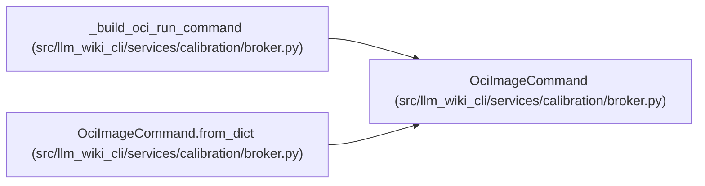

# OciImageCommand

**Location:** `src/llm_wiki_cli/services/calibration/broker.py:155`
**Kind:** Class
**Bases:** —
**Module:** [broker](../modules/broker.md)

**Decorators:** `@dataclass(frozen=True)`

## Description

One digest-pinned OCI image and its fixed in-container entrypoint.

## Attributes

| Name | Type | Default | Description |
|------|------|---------|-------------|
| `image` | `str` | *required* | — |
| `entrypoint` | `tuple[str, ...]` | *required* | — |

## Methods

| Method | Signature | Decorators | Description |
|--------|-----------|------------|-------------|
| `__post_init__` | `() -> None` | — | — |
| `digest` | `() -> str` | `@property` | Return the digest-pinned image identifier. |
| `to_dict` | `() -> dict[str, Any]` | — | — |
| `from_dict` | `(payload: Mapping[str, Any], *, label: str) -> 'OciImageCommand'` | `@classmethod` | — |

## Relationships

<!-- Auto-generated relationship summary. Do not edit by hand. -->

### Summary

| Module | Methods | Attributes |
|---|---:|---|
| [broker](../modules/broker.md) | 4 | `entrypoint`, `image` |

### References

| Reference | Kind | Source | Call sites |
|---|---|---|---:|
| `_build_oci_run_command` | type_reference | [broker](../modules/broker.md) | — |
| `OciImageCommand.from_dict` | type_reference | [broker](../modules/broker.md) | — |
