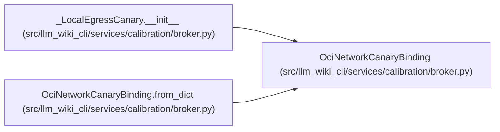

# OciNetworkCanaryBinding

**Location:** `src/llm_wiki_cli/services/calibration/broker.py:1227`
**Kind:** Class
**Bases:** —
**Module:** [broker](../modules/broker.md)

**Decorators:** `@dataclass(frozen=True)`

## Description

Host-controlled loopback canary with a successful pre-probe control.

## Attributes

| Name | Type | Default | Description |
|------|------|---------|-------------|
| `canary_id` | `str` | *required* | — |
| `host` | `str` | *required* | — |
| `port` | `int` | *required* | — |
| `challenge` | `str` | *required* | — |
| `challenge_sha256` | `str` | *required* | — |
| `response_sha256` | `str` | *required* | — |
| `control_sha256` | `str` | *required* | — |

## Methods

| Method | Signature | Decorators | Description |
|--------|-----------|------------|-------------|
| `__post_init__` | `() -> None` | — | — |
| `to_dict` | `() -> dict[str, Any]` | — | — |
| `from_dict` | `(payload: Mapping[str, Any]) -> 'OciNetworkCanaryBinding'` | `@classmethod` | — |

## Relationships

<!-- Auto-generated relationship summary. Do not edit by hand. -->

### Summary

| Module | Methods | Attributes |
|---|---:|---|
| [broker](../modules/broker.md) | 3 | `canary_id`, `challenge`, `challenge_sha256`, `control_sha256`, `host`, `port`, `response_sha256` |

### References

| Reference | Kind | Source | Call sites |
|---|---|---|---:|
| `_LocalEgressCanary.__init__` | call | [broker](../modules/broker.md) | 1 |
| `OciNetworkCanaryBinding.from_dict` | type_reference | [broker](../modules/broker.md) | — |
