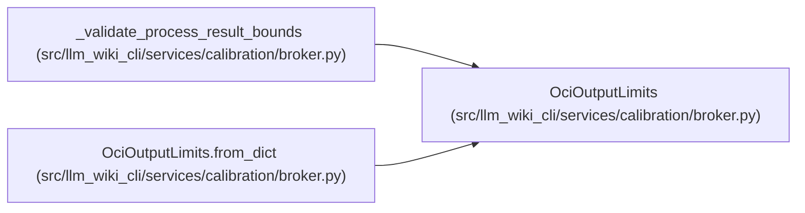

# OciOutputLimits

**Location:** `src/llm_wiki_cli/services/calibration/broker.py:257`
**Kind:** Class
**Bases:** —
**Module:** [broker](../modules/broker.md)

**Decorators:** `@dataclass(frozen=True)`

## Description

Bounded process and result capture sizes.

## Attributes

| Name | Type | Default | Description |
|------|------|---------|-------------|
| `stdout_bytes` | `int` | *required* | — |
| `stderr_bytes` | `int` | *required* | — |
| `result_bytes` | `int` | *required* | — |

## Methods

| Method | Signature | Decorators | Description |
|--------|-----------|------------|-------------|
| `__post_init__` | `() -> None` | — | — |
| `to_dict` | `() -> dict[str, int]` | — | — |
| `from_dict` | `(payload: Mapping[str, Any]) -> 'OciOutputLimits'` | `@classmethod` | — |

## Relationships

<!-- Auto-generated relationship summary. Do not edit by hand. -->

### Summary

| Module | Methods | Attributes |
|---|---:|---|
| [broker](../modules/broker.md) | 3 | `result_bytes`, `stderr_bytes`, `stdout_bytes` |

### References

| Reference | Kind | Source |
|---|---|---|
| `_validate_process_result_bounds` | type_reference | [broker](../modules/broker.md) |
| `OciOutputLimits.from_dict` | type_reference | [broker](../modules/broker.md) |
