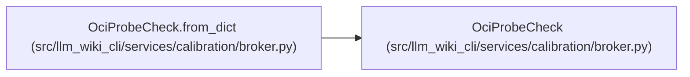

# OciProbeCheck

**Location:** `src/llm_wiki_cli/services/calibration/broker.py:1548`
**Kind:** Class
**Bases:** —
**Module:** [broker](../modules/broker.md)

**Decorators:** `@dataclass(frozen=True)`

## Description

One mandatory, request-bound adversarial isolation attempt.

## Attributes

| Name | Type | Default | Description |
|------|------|---------|-------------|
| `probe` | `str` | *required* | — |
| `target_id` | `str` | *required* | — |
| `target_sha256` | `str` | *required* | — |
| `attempted` | `bool` | *required* | — |
| `outcome` | `str` | *required* | — |
| `evidence` | `Mapping[str, Any]` | *required* | — |
| `detail` | `str` | *required* | — |

## Methods

| Method | Signature | Decorators | Description |
|--------|-----------|------------|-------------|
| `__post_init__` | `() -> None` | — | — |
| `_validate_evidence` | `() -> None` | — | — |
| `to_dict` | `() -> dict[str, Any]` | — | — |
| `from_dict` | `(payload: Mapping[str, Any]) -> 'OciProbeCheck'` | `@classmethod` | — |

## Relationships

<!-- Auto-generated relationship summary. Do not edit by hand. -->

### Summary

| Module | Methods | Attributes |
|---|---:|---|
| [broker](../modules/broker.md) | 4 | `attempted`, `detail`, `evidence`, `outcome`, `probe`, `target_id`, `target_sha256` |

### References

| Reference | Kind | Source |
|---|---|---|
| `OciProbeCheck.from_dict` | type_reference | [broker](../modules/broker.md) |
