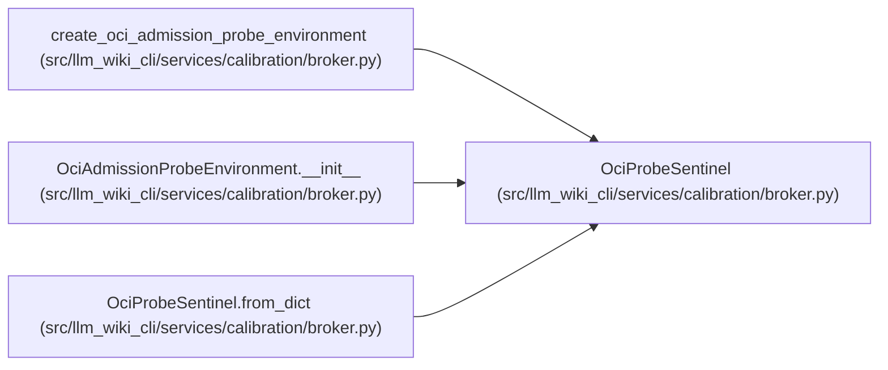

# OciProbeSentinel

**Location:** `src/llm_wiki_cli/services/calibration/broker.py:1165`
**Kind:** Class
**Bases:** —
**Module:** [broker](../modules/broker.md)

**Decorators:** `@dataclass(frozen=True)`

## Description

One real host file that must remain inaccessible to the probe container.

## Attributes

| Name | Type | Default | Description |
|------|------|---------|-------------|
| `probe` | `str` | *required* | — |
| `sentinel_id` | `str` | *required* | — |
| `host_path` | `str` | *required* | — |
| `content_sha256` | `str` | *required* | — |
| `content_bytes` | `int` | *required* | — |

## Methods

| Method | Signature | Decorators | Description |
|--------|-----------|------------|-------------|
| `__post_init__` | `() -> None` | — | — |
| `to_dict` | `() -> dict[str, Any]` | — | — |
| `from_dict` | `(payload: Mapping[str, Any]) -> 'OciProbeSentinel'` | `@classmethod` | — |

## Relationships

<!-- Auto-generated relationship summary. Do not edit by hand. -->

### Summary

| Module | Methods | Attributes |
|---|---:|---|
| [broker](../modules/broker.md) | 3 | `content_bytes`, `content_sha256`, `host_path`, `probe`, `sentinel_id` |

### References

| Reference | Kind | Source |
|---|---|---|
| `create_oci_admission_probe_environment` | call | [broker](../modules/broker.md) |
| `OciAdmissionProbeEnvironment.__init__` | type_reference | [broker](../modules/broker.md) |
| `OciProbeSentinel.from_dict` | type_reference | [broker](../modules/broker.md) |
