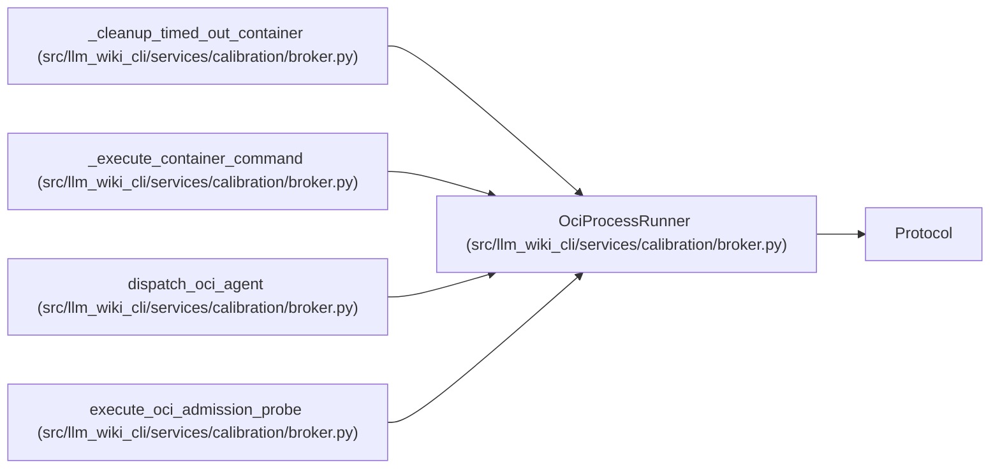

# OciProcessRunner

**Location:** `src/llm_wiki_cli/services/calibration/broker.py:137`
**Kind:** Class
**Bases:** `Protocol`
**Module:** [broker](../modules/broker.md)

## Description

Dependency-injected bounded process runner.

## Attributes

*No annotated attributes found.*

## Methods

| Method | Signature | Decorators | Description |
|--------|-----------|------------|-------------|
| `__call__` | `(argv: Sequence[str], *, env: Mapping[str, str], timeout_seconds: int, termination_grace_seconds: int, stdout_limit: int, stderr_limit: int) -> 'BoundedProcessResult'` | — | Execute one fixed argument vector without a shell. |

## Relationships

<!-- Auto-generated relationship summary. Do not edit by hand. -->

### Summary

| Module | Methods | Attributes |
|---|---:|---|
| [broker](../modules/broker.md) | 1 | — |

### Structure

| Kind | Entity | Module |
|---|---|---|
| Base | `Protocol` | — |

### References

| Reference | Kind | Source | Call sites |
|---|---|---|---:|
| `_cleanup_timed_out_container` | type_reference | [broker](../modules/broker.md) | — |
| `_execute_container_command` | type_reference | [broker](../modules/broker.md) | — |
| `dispatch_oci_agent` | type_reference | [broker](../modules/broker.md) | — |
| `execute_oci_admission_probe` | type_reference | [broker](../modules/broker.md) | — |
