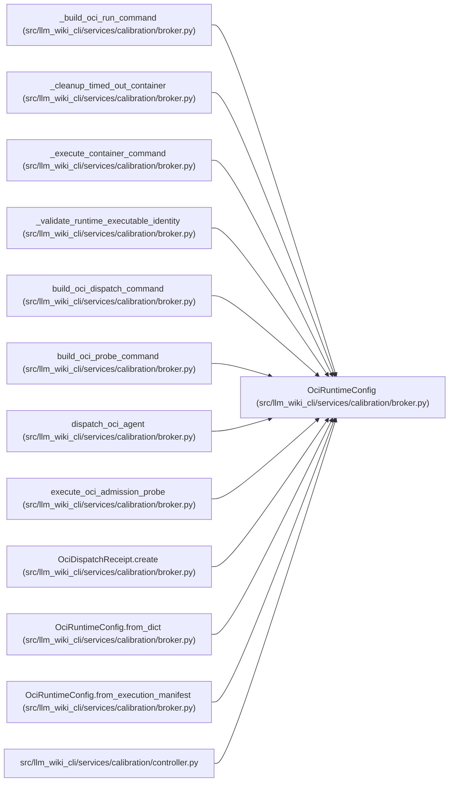

# OciRuntimeConfig

**Location:** `src/llm_wiki_cli/services/calibration/broker.py:306`
**Kind:** Class
**Bases:** —
**Module:** [broker](../modules/broker.md)

**Decorators:** `@dataclass(frozen=True)`

## Description

Strict local-no-egress section of a frozen execution manifest.

## Attributes

| Name | Type | Default | Description |
|------|------|---------|-------------|
| `runtime` | `str` | *required* | — |
| `executable` | `str` | *required* | — |
| `executable_sha256` | `str` | *required* | — |
| `worker` | `OciImageCommand` | *required* | — |
| `probe` | `OciImageCommand` | *required* | — |
| `user` | `str` | *required* | — |
| `resources` | `OciResourceLimits` | *required* | — |
| `timeout_seconds` | `int` | *required* | — |
| `termination_grace_seconds` | `int` | *required* | — |
| `max_packet_bytes` | `int` | *required* | — |
| `output_limits` | `OciOutputLimits` | *required* | — |

## Methods

| Method | Signature | Decorators | Description |
|--------|-----------|------------|-------------|
| `__post_init__` | `() -> None` | — | — |
| `to_dict` | `() -> dict[str, Any]` | — | — |
| `from_dict` | `(payload: Mapping[str, Any]) -> 'OciRuntimeConfig'` | `@classmethod` | Parse an exact, credential-free OCI runtime object. |
| `from_execution_manifest` | `(payload: Mapping[str, Any]) -> 'OciRuntimeConfig'` | `@classmethod` | Extract the strict OCI object from a broader execution manifest. |

## Relationships

<!-- Auto-generated relationship summary. Do not edit by hand. -->

### Summary

| Module | Methods | Attributes |
|---|---:|---|
| [broker](../modules/broker.md) | 4 | `executable`, `executable_sha256`, `max_packet_bytes`, `output_limits`, `probe`, `resources`, `runtime`, `termination_grace_seconds`, `timeout_seconds`, `user`, `worker` |

### References

| Reference | Kind | Source |
|---|---|---|
| `_build_oci_run_command` | type_reference | [broker](../modules/broker.md) |
| `_cleanup_timed_out_container` | type_reference | [broker](../modules/broker.md) |
| `_execute_container_command` | type_reference | [broker](../modules/broker.md) |
| `_validate_runtime_executable_identity` | type_reference | [broker](../modules/broker.md) |
| `build_oci_dispatch_command` | type_reference | [broker](../modules/broker.md) |
| `build_oci_probe_command` | type_reference | [broker](../modules/broker.md) |
| `dispatch_oci_agent` | type_reference | [broker](../modules/broker.md) |
| `execute_oci_admission_probe` | type_reference | [broker](../modules/broker.md) |
| `OciDispatchReceipt.create` | type_reference | [broker](../modules/broker.md) |
| `OciRuntimeConfig.from_dict` | type_reference | [broker](../modules/broker.md) |
| `OciRuntimeConfig.from_execution_manifest` | type_reference | [broker](../modules/broker.md) |
| `controller` | import | [controller](../modules/controller.md) |
