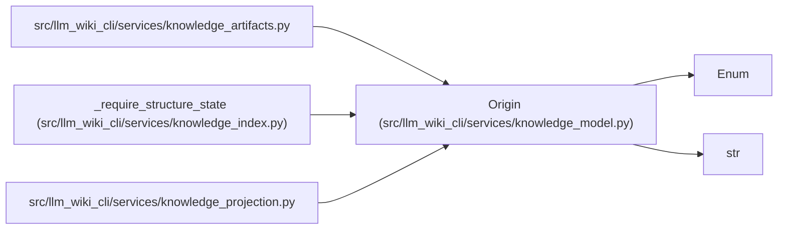

# Origin

**Location:** `src/llm_wiki_cli/services/knowledge_model.py:115`
**Kind:** Enum
**Bases:** `str`, `Enum`
**Module:** [knowledge_model](../modules/knowledge_model.md)

## Description

_Auto-generated from `Origin` in `src/llm_wiki_cli/services/knowledge_model.py`._

## Attributes

| Name | Declared value | Description |
|------|-------|-------------|
| `UNKNOWN` | `'unknown'` | — |
| `EXTRACTED` | `'extracted'` | — |
| `AUTHORED` | `'authored'` | — |
| `INFERRED` | `'inferred'` | — |
| `IMPORTED` | `'imported'` | — |
| `MARKDOWN` | `'markdown'` | — |
| `GOVERNANCE` | `'governance'` | — |

## Methods

*No public methods. Inherits from base classes.*

## Relationships

<!-- Auto-generated relationship summary. Do not edit by hand. -->

### Summary

| Module | Methods | Attributes |
|---|---:|---|
| [knowledge_model](../modules/knowledge_model.md) | 0 | `AUTHORED`, `EXTRACTED`, `GOVERNANCE`, `IMPORTED`, `INFERRED`, `MARKDOWN`, `UNKNOWN` |

### Structure

| Kind | Entity | Module |
|---|---|---|
| Base | `Enum` | — |
| Base | `str` | — |

### References

| Reference | Kind | Source |
|---|---|---|
| `knowledge_artifacts` | import | [knowledge_artifacts](../modules/knowledge_artifacts.md) |
| `_require_structure_state` | type_reference | [knowledge_index](../modules/knowledge_index.md) |
| `knowledge_projection` | import | [knowledge_projection](../modules/knowledge_projection.md) |
