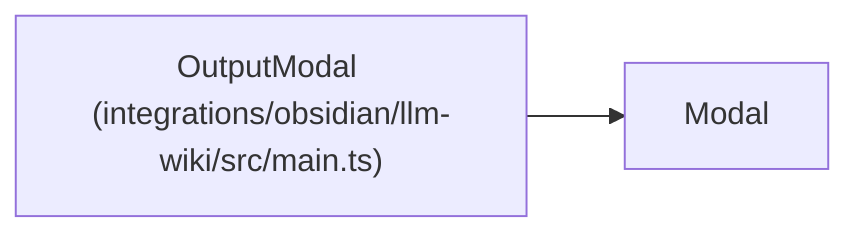

# OutputModal

**Location:** `integrations/obsidian/llm-wiki/src/main.ts:116`
**Kind:** Class
**Bases:** `Modal`
**Module:** [src_main](../modules/src_main.md)

## Description

_Auto-generated from `OutputModal` in `integrations/obsidian/llm-wiki/src/main.ts`._

## Attributes

*No annotated attributes found.*

## Methods

| Method | Signature | Decorators | Description |
|--------|-----------|------------|-------------|
| `onOpen` | `()` | — | — |
| `constructor` | `(app: App, title: string, body: string)` | — | — |

## Relationships

<!-- Auto-generated relationship summary. Do not edit by hand. -->

### Summary

| Module | Methods | Attributes |
|---|---:|---|
| [src_main](../modules/src_main.md) | 2 | — |

### Structure

| Kind | Entity | Module |
|---|---|---|
| Base | `Modal` | — |
