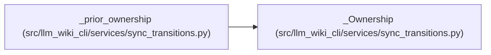

# _Ownership

**Location:** `src/llm_wiki_cli/services/sync_transitions.py:70`
**Kind:** Class
**Bases:** —
**Module:** [sync_transitions](../modules/sync_transitions.md)

**Decorators:** `@dataclass`

## Description

_Auto-generated from `_Ownership` in `src/llm_wiki_cli/services/sync_transitions.py`._

## Attributes

| Name | Type | Default | Description |
|------|------|---------|-------------|
| `candidates` | `dict[ManifestPageSource, set[str]]` | `field(default_factory=dict)` | — |
| `claims` | `dict[str, set[ManifestPageSource]]` | `field(default_factory=dict)` | — |

## Methods

| Method | Signature | Decorators | Description |
|--------|-----------|------------|-------------|
| `add` | `(owner: ManifestPageSource, path: str, *, candidate: bool = True) -> None` | — | — |
| `resolve` | `(owner: ManifestPageSource) -> str \| None` | — | — |

## Relationships

<!-- Auto-generated relationship summary. Do not edit by hand. -->

### Summary

| Module | Methods | Attributes |
|---|---:|---|
| [sync_transitions](../modules/sync_transitions.md) | 2 | `candidates`, `claims` |

### References

| Reference | Kind | Source | Call sites |
|---|---|---|---:|
| `_prior_ownership` | call | [sync_transitions](../modules/sync_transitions.md) | 1 |
| `_prior_ownership` | type_reference | [sync_transitions](../modules/sync_transitions.md) | — |
