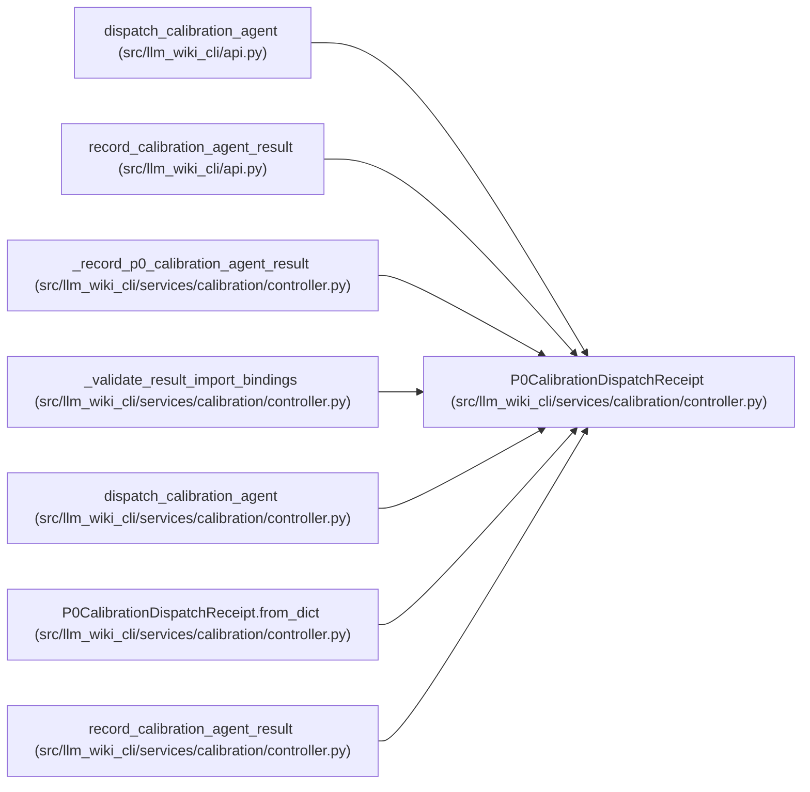

# P0CalibrationDispatchReceipt

**Location:** `src/llm_wiki_cli/services/calibration/controller.py:445`
**Kind:** Class
**Bases:** —
**Module:** [controller](../modules/controller.md)

**Decorators:** `@dataclass(frozen=True)`

## Description

Broker receipt binding one invocation to protected controller state.

## Attributes

| Name | Type | Default | Description |
|------|------|---------|-------------|
| `payload` | `dict[str, Any]` | *required* | — |

## Methods

| Method | Signature | Decorators | Description |
|--------|-----------|------------|-------------|
| `from_dict` | `(payload: Mapping[str, Any]) -> 'P0CalibrationDispatchReceipt'` | `@classmethod` | — |
| `receipt_id` | `() -> str` | `@property` | — |
| `to_dict` | `() -> dict[str, Any]` | — | — |
| `to_json` | `() -> str` | — | — |

## Relationships

<!-- Auto-generated relationship summary. Do not edit by hand. -->

### Summary

| Module | Methods | Attributes |
|---|---:|---|
| [controller](../modules/controller.md) | 4 | `payload` |

### References

| Reference | Kind | Source | Call sites |
|---|---|---|---:|
| `dispatch_calibration_agent` | type_reference | [api](../modules/api.md) | — |
| `record_calibration_agent_result` | type_reference | [api](../modules/api.md) | — |
| `_record_p0_calibration_agent_result` | type_reference | [controller](../modules/controller.md) | — |
| `_validate_result_import_bindings` | type_reference | [controller](../modules/controller.md) | — |
| `dispatch_calibration_agent` | type_reference | [controller](../modules/controller.md) | — |
| `P0CalibrationDispatchReceipt.from_dict` | type_reference | [controller](../modules/controller.md) | — |
| `record_calibration_agent_result` | type_reference | [controller](../modules/controller.md) | — |
