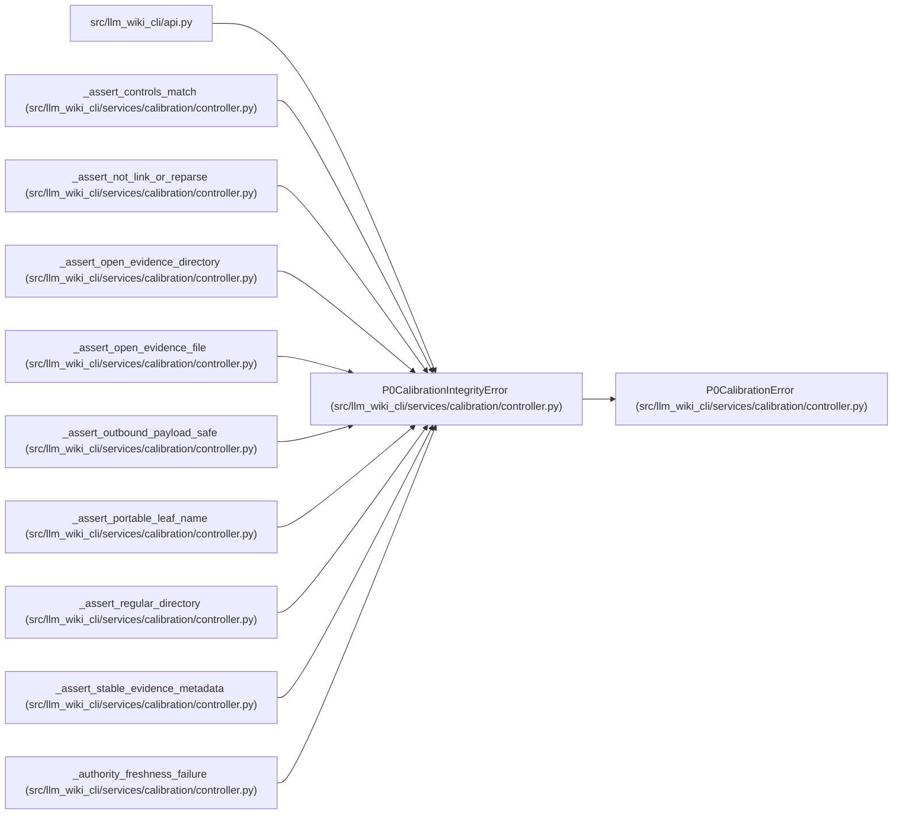

# P0CalibrationIntegrityError

**Location:** `src/llm_wiki_cli/services/calibration/controller.py:233`
**Kind:** Class
**Bases:** `P0CalibrationError`
**Module:** [controller](../modules/controller.md)

## Description

Raised when protected evidence or ledger integrity is violated.

## Attributes

*No annotated attributes found.*

## Methods

*No public methods. Inherits from base classes.*

## Relationships

<!-- Auto-generated relationship summary. Do not edit by hand. -->

### Summary

| Module | Methods | Attributes |
|---|---:|---|
| [controller](../modules/controller.md) | 0 | — |

### Structure

| Kind | Entity | Module |
|---|---|---|
| Base | `P0CalibrationError` | [controller](../modules/controller.md) |

### References

| Reference | Kind | Source |
|---|---|---|
| `api` | import | [api](../modules/api.md) |
| `_assert_controls_match` | call | [controller](../modules/controller.md) |
| `_assert_not_link_or_reparse` | call | [controller](../modules/controller.md) |
| `_assert_not_link_or_reparse` | call | [controller](../modules/controller.md) |
| `_assert_open_evidence_directory` | call | [controller](../modules/controller.md) |
| `_assert_open_evidence_file` | call | [controller](../modules/controller.md) |
| `_assert_outbound_payload_safe` | call | [controller](../modules/controller.md) |
| `_assert_portable_leaf_name` | call | [controller](../modules/controller.md) |
| `_assert_regular_directory` | call | [controller](../modules/controller.md) |
| `_assert_stable_evidence_metadata` | call | [controller](../modules/controller.md) |
| `_authority_freshness_failure` | call | [controller](../modules/controller.md) |
| `_authority_freshness_failure` | call | [controller](../modules/controller.md) |
