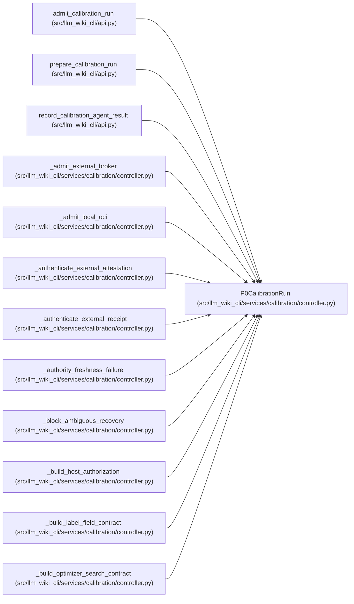

# P0CalibrationRun

**Location:** `src/llm_wiki_cli/services/calibration/controller.py:261`
**Kind:** Class
**Bases:** —
**Module:** [controller](../modules/controller.md)

**Decorators:** `@dataclass(frozen=True)`

## Description

Current protected controller snapshot.

## Attributes

| Name | Type | Default | Description |
|------|------|---------|-------------|
| `payload` | `dict[str, Any]` | *required* | — |

## Methods

| Method | Signature | Decorators | Description |
|--------|-----------|------------|-------------|
| `from_dict` | `(payload: Mapping[str, Any]) -> 'P0CalibrationRun'` | `@classmethod` | — |
| `cohort_id` | `() -> str` | `@property` | — |
| `state` | `() -> str` | `@property` | — |
| `generation` | `() -> int` | `@property` | — |
| `head_transition_hash` | `() -> str` | `@property` | — |
| `to_dict` | `() -> dict[str, Any]` | — | — |
| `to_json` | `() -> str` | — | — |

## Relationships

<!-- Auto-generated relationship summary. Do not edit by hand. -->

### Summary

| Module | Methods | Attributes |
|---|---:|---|
| [controller](../modules/controller.md) | 7 | `payload` |

### References

| Reference | Kind | Source |
|---|---|---|
| `admit_calibration_run` | type_reference | [api](../modules/api.md) |
| `prepare_calibration_run` | type_reference | [api](../modules/api.md) |
| `record_calibration_agent_result` | type_reference | [api](../modules/api.md) |
| `_admit_external_broker` | type_reference | [controller](../modules/controller.md) |
| `_admit_local_oci` | type_reference | [controller](../modules/controller.md) |
| `_authenticate_external_attestation` | type_reference | [controller](../modules/controller.md) |
| `_authenticate_external_receipt` | type_reference | [controller](../modules/controller.md) |
| `_authority_freshness_failure` | type_reference | [controller](../modules/controller.md) |
| `_block_ambiguous_recovery` | type_reference | [controller](../modules/controller.md) |
| `_build_host_authorization` | type_reference | [controller](../modules/controller.md) |
| `_build_label_field_contract` | type_reference | [controller](../modules/controller.md) |
| `_build_optimizer_search_contract` | type_reference | [controller](../modules/controller.md) |
