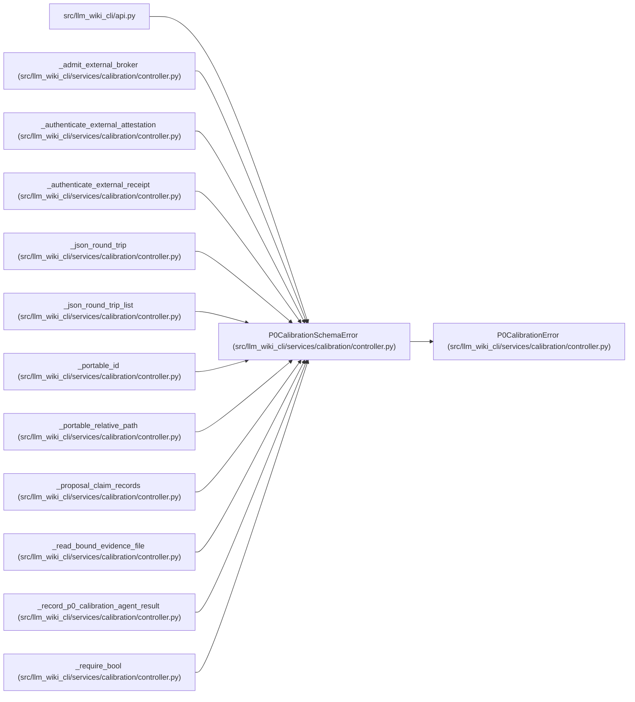

# P0CalibrationSchemaError

**Location:** `src/llm_wiki_cli/services/calibration/controller.py:229`
**Kind:** Class
**Bases:** `P0CalibrationError`
**Module:** [controller](../modules/controller.md)

## Description

Raised when a calibration contract is malformed.

## Attributes

*No annotated attributes found.*

## Methods

*No public methods. Inherits from base classes.*

## Relationships

<!-- Auto-generated relationship summary. Do not edit by hand. -->

### Summary

| Module | Methods | Attributes |
|---|---:|---|
| [controller](../modules/controller.md) | 0 | — |

### Structure

| Kind | Entity | Module |
|---|---|---|
| Base | `P0CalibrationError` | [controller](../modules/controller.md) |

### References

| Reference | Kind | Source | Call sites |
|---|---|---|---:|
| `api` | import | [api](../modules/api.md) | — |
| `_admit_external_broker` | call | [controller](../modules/controller.md) | 1 |
| `_authenticate_external_attestation` | call | [controller](../modules/controller.md) | 1 |
| `_authenticate_external_receipt` | call | [controller](../modules/controller.md) | 1 |
| `_json_round_trip` | call | [controller](../modules/controller.md) | 3 |
| `_json_round_trip_list` | call | [controller](../modules/controller.md) | 1 |
| `_portable_id` | call | [controller](../modules/controller.md) | 1 |
| `_portable_relative_path` | call | [controller](../modules/controller.md) | 2 |
| `_proposal_claim_records` | call | [controller](../modules/controller.md) | 5 |
| `_read_bound_evidence_file` | call | [controller](../modules/controller.md) | 1 |
| `_record_p0_calibration_agent_result` | call | [controller](../modules/controller.md) | 1 |
| `_require_bool` | call | [controller](../modules/controller.md) | 1 |

> References: showing 12 of 43 logical references; 31 omitted by the 12-row generated summary limit.
