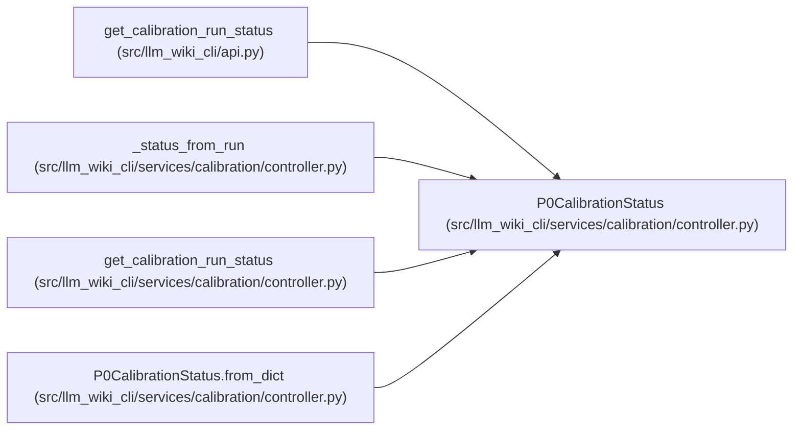

# P0CalibrationStatus

**Location:** `src/llm_wiki_cli/services/calibration/controller.py:299`
**Kind:** Class
**Bases:** —
**Module:** [controller](../modules/controller.md)

**Decorators:** `@dataclass(frozen=True)`

## Description

Operator-facing status for one calibration cohort.

## Attributes

| Name | Type | Default | Description |
|------|------|---------|-------------|
| `cohort_id` | `str` | *required* | — |
| `state` | `str` | *required* | — |
| `generation` | `int` | *required* | — |
| `decision_scope` | `str` | *required* | — |
| `admission_profile` | `str` | *required* | — |
| `role_statuses` | `dict[str, str]` | *required* | — |
| `next_actions` | `tuple[str, ...]` | *required* | — |
| `limitations` | `tuple[str, ...]` | *required* | — |
| `terminal` | `bool` | *required* | — |
| `healthy` | `bool` | *required* | — |

## Methods

| Method | Signature | Decorators | Description |
|--------|-----------|------------|-------------|
| `from_dict` | `(payload: Mapping[str, Any]) -> 'P0CalibrationStatus'` | `@classmethod` | — |
| `to_dict` | `() -> dict[str, Any]` | — | — |
| `to_json` | `() -> str` | — | — |

## Relationships

<!-- Auto-generated relationship summary. Do not edit by hand. -->

### Summary

| Module | Methods | Attributes |
|---|---:|---|
| [controller](../modules/controller.md) | 3 | `admission_profile`, `cohort_id`, `decision_scope`, `generation`, `healthy`, `limitations`, `next_actions`, `role_statuses`, `state`, `terminal` |

### References

| Reference | Kind | Source |
|---|---|---|
| `get_calibration_run_status` | type_reference | [api](../modules/api.md) |
| `_status_from_run` | call | [controller](../modules/controller.md) |
| `_status_from_run` | type_reference | [controller](../modules/controller.md) |
| `get_calibration_run_status` | type_reference | [controller](../modules/controller.md) |
| `P0CalibrationStatus.from_dict` | type_reference | [controller](../modules/controller.md) |
