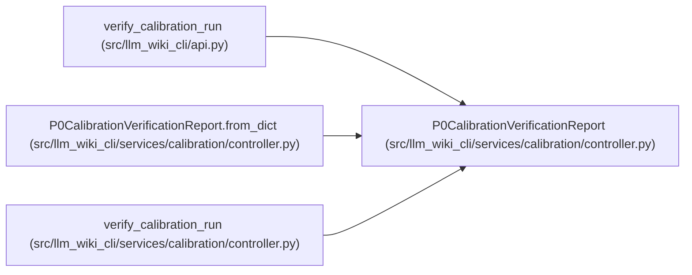

# P0CalibrationVerificationReport

**Location:** `src/llm_wiki_cli/services/calibration/controller.py:471`
**Kind:** Class
**Bases:** —
**Module:** [controller](../modules/controller.md)

**Decorators:** `@dataclass(frozen=True)`

## Description

Recomputed evidence, citation, and transition gates.

## Attributes

| Name | Type | Default | Description |
|------|------|---------|-------------|
| `payload` | `dict[str, Any]` | *required* | — |

## Methods

| Method | Signature | Decorators | Description |
|--------|-----------|------------|-------------|
| `from_dict` | `(payload: Mapping[str, Any]) -> 'P0CalibrationVerificationReport'` | `@classmethod` | — |
| `ok` | `() -> bool` | `@property` | — |
| `to_dict` | `() -> dict[str, Any]` | — | — |
| `to_json` | `() -> str` | — | — |

## Relationships

<!-- Auto-generated relationship summary. Do not edit by hand. -->

### Summary

| Module | Methods | Attributes |
|---|---:|---|
| [controller](../modules/controller.md) | 4 | `payload` |

### References

| Reference | Kind | Source | Call sites |
|---|---|---|---:|
| `verify_calibration_run` | type_reference | [api](../modules/api.md) | — |
| `P0CalibrationVerificationReport.from_dict` | type_reference | [controller](../modules/controller.md) | — |
| `verify_calibration_run` | type_reference | [controller](../modules/controller.md) | — |
