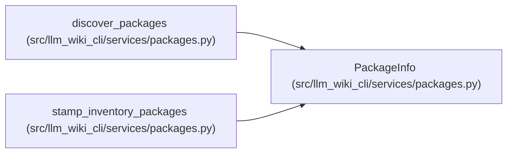

# PackageInfo

**Location:** `src/llm_wiki_cli/services/packages.py:31`
**Kind:** Class
**Bases:** —
**Module:** [packages](../modules/packages.md)

**Decorators:** `@dataclass(frozen=True)`

## Description

Metadata for a single Python package discovered on disk.

## Attributes

| Name | Type | Default | Description |
|------|------|---------|-------------|
| `name` | `str` | *required* | — |
| `root` | `str` | *required* | — |
| `version` | `str` | *required* | — |
| `marker_path` | `str` | *required* | — |

## Methods

*No public methods. Inherits from base classes.*

## Relationships

<!-- Auto-generated relationship summary. Do not edit by hand. -->

### Summary

| Module | Methods | Attributes |
|---|---:|---|
| [packages](../modules/packages.md) | 0 | `marker_path`, `name`, `root`, `version` |

### References

| Reference | Kind | Source | Call sites |
|---|---|---|---:|
| `discover_packages` | call | [packages](../modules/packages.md) | 2 |
| `discover_packages` | type_reference | [packages](../modules/packages.md) | — |
| `stamp_inventory_packages` | type_reference | [packages](../modules/packages.md) | — |
