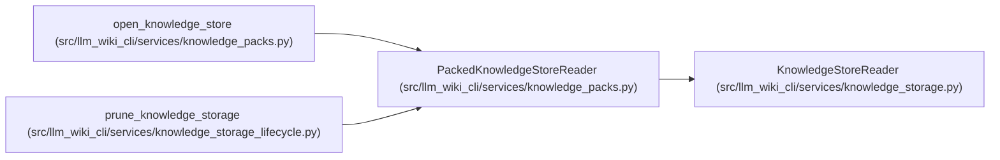

# PackedKnowledgeStoreReader

**Location:** `src/llm_wiki_cli/services/knowledge_packs.py:328`
**Kind:** Class
**Bases:** `KnowledgeStoreReader`
**Module:** [knowledge_packs](../modules/knowledge_packs.md)

## Description

Reads logical knowledge objects through authenticated pack and member catalogs, reusing the existing record and evidence validators. Selected mode consumes bounded member ranges and leaves unrelated members and archive metadata unverified. Full materialization verifies every referenced container and reconciles archive, locator and logical membership. Physical pack/index bytes are retained separately from the logical object cache.

## Attributes

*No annotated attributes found.*

## Methods

| Method | Signature | Decorators | Description |
|--------|-----------|------------|-------------|
| `__init__` | `(root_bytes: bytes, read_file: Callable[[str, int], bytes], *, read_range: RangeReader \| None = None, **limits)` | — | — |
| `_physical` | `(path: str, size: int) -> bytes` | — | — |
| `_index` | `(descriptor: dict[str, Any], prefix: str, leaf_kind: str = 'members') -> dict[str, Any]` | — | — |
| `_find_entry` | `(key: str, leaf_kind: str) -> Any` | — | — |
| `_find` | `(key: str) -> tuple[dict[str, Any], list[Any]]` | — | — |
| `_pack` | `(descriptor: dict[str, Any]) -> bytes` | — | — |
| `_read_member` | `(logical_path: str, maximum: int) -> bytes` | — | — |
| `materialize` | `(*, audit_routes: bool = True) -> dict[str, Any]` | — | — |
| `select` | `(selectors, *, max_records: int = 1000) -> KnowledgeSlice` | — | — |

## Relationships

<!-- Auto-generated relationship summary. Do not edit by hand. -->

### Summary

| Module | Methods | Attributes |
|---|---:|---|
| [knowledge_packs](../modules/knowledge_packs.md) | 9 | — |

### Structure

| Kind | Entity | Module |
|---|---|---|
| Base | `KnowledgeStoreReader` | [knowledge_storage](../modules/knowledge_storage.md) |

### References

| Reference | Kind | Source | Call sites |
|---|---|---|---:|
| `open_knowledge_store` | call | [knowledge_packs](../modules/knowledge_packs.md) | 1 |
| `prune_knowledge_storage` | call | [knowledge_storage_lifecycle](../modules/knowledge_storage_lifecycle.md) | 1 |
