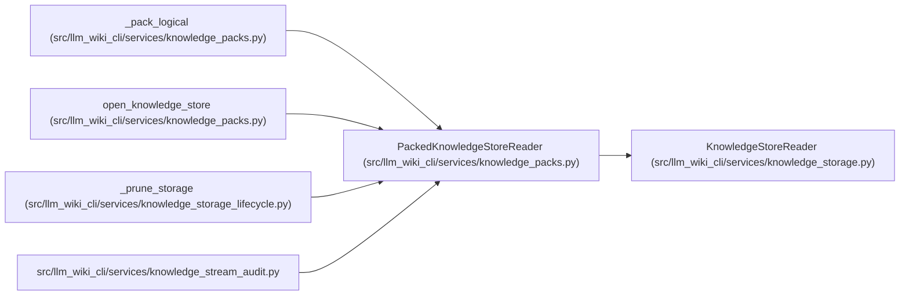

# PackedKnowledgeStoreReader

**Location:** `src/llm_wiki_cli/services/knowledge_packs.py:568`
**Kind:** Class
**Bases:** `KnowledgeStoreReader`
**Module:** [knowledge_packs](../modules/knowledge_packs.md)

## Description

Reads selected authenticated member ranges or fully captures indexed ZIP storage. Full capture validates every logical member once, then checks complete archive structure and routing against those observations. Audit statistics can be retained after redundant decoder state is released.

## Attributes

*No annotated attributes found.*

## Methods

| Method | Signature | Decorators | Description |
|--------|-----------|------------|-------------|
| `__init__` | `(root_bytes: bytes, read_file: Callable[[str, int], bytes], *, read_range: RangeReader \| None = None, **limits)` | — | — |
| `_physical` | `(path: str, size: int) -> bytes` | — | — |
| `_index` | `(descriptor: dict[str, Any], prefix: str, leaf_kind: str = 'members') -> dict[str, Any]` | — | — |
| `_find_entry` | `(key: str, leaf_kind: str) -> Any` | — | — |
| `_find` | `(key: str) -> tuple[dict[str, Any], list[Any]]` | — | — |
| `_pack` | `(descriptor: dict[str, Any]) -> bytes` | — | — |
| `_read_member` | `(logical_path: str, maximum: int) -> bytes` | — | — |
| `_node` | `(desc, collection, prefix)` | — | — |
| `materialize` | `(*, audit_routes: bool = True) -> dict[str, Any]` | — | — |
| `audit_containers` | `() -> None` | — | Reconcile all captured logical members with complete archive routing. |
| `select` | `(selectors, *, max_records: int = 1000, collections = None) -> KnowledgeSlice` | — | — |
| `statistics` | `() -> dict[str, Any]` | — | — |
| `release_capture` | `() -> None` | — | — |

## Relationships

<!-- Auto-generated relationship summary. Do not edit by hand. -->

### Summary

| Module | Methods | Attributes |
|---|---:|---|
| [knowledge_packs](../modules/knowledge_packs.md) | 13 | — |

### Structure

| Kind | Entity | Module |
|---|---|---|
| Base | `KnowledgeStoreReader` | [knowledge_storage](../modules/knowledge_storage.md) |

### References

| Reference | Kind | Source | Call sites |
|---|---|---|---:|
| `_pack_logical` | call | [knowledge_packs](../modules/knowledge_packs.md) | 1 |
| `open_knowledge_store` | call | [knowledge_packs](../modules/knowledge_packs.md) | 1 |
| `_prune_storage` | call | [knowledge_storage_lifecycle](../modules/knowledge_storage_lifecycle.md) | 1 |
| `knowledge_stream_audit` | import | [knowledge_stream_audit](../modules/knowledge_stream_audit.md) | — |
