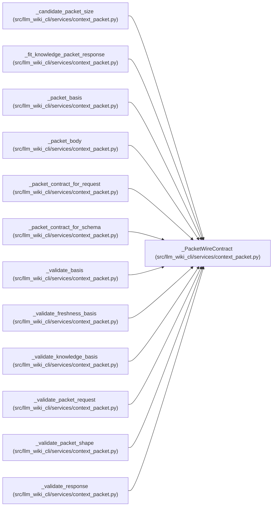

# _PacketWireContract

**Location:** `src/llm_wiki_cli/services/context_packet.py:180`
**Kind:** Class
**Bases:** —
**Module:** [context_packet](../modules/context_packet.md)

**Decorators:** `@dataclass(frozen=True)`

## Description

One immutable schema/protocol/policy binding for canonical packets.

## Attributes

| Name | Type | Default | Description |
|------|------|---------|-------------|
| `schema_version` | `str` | *required* | — |
| `context_protocol` | `str` | *required* | — |
| `policy_version` | `str` | *required* | — |
| `packet_digest_domain` | `bytes` | *required* | — |
| `policy_digest_domain` | `str` | *required* | — |
| `max_packet_bytes` | `int` | *required* | — |
| `knowledge_mode_required` | `bool` | *required* | — |
| `knowledge_concept_limit` | `int \| None` | *required* | — |
| `knowledge_page_limit` | `int \| None` | *required* | — |
| `knowledge_relationship_limit` | `int \| None` | *required* | — |

## Methods

*No public methods. Inherits from base classes.*

## Relationships

<!-- Auto-generated relationship summary. Do not edit by hand. -->

### Summary

| Module | Methods | Attributes |
|---|---:|---|
| [context_packet](../modules/context_packet.md) | 0 | `context_protocol`, `knowledge_concept_limit`, `knowledge_mode_required`, `knowledge_page_limit`, `knowledge_relationship_limit`, `max_packet_bytes`, `packet_digest_domain`, `policy_digest_domain`, `policy_version`, `schema_version` |

### References

| Reference | Kind | Source |
|---|---|---|
| `_candidate_packet_size` | type_reference | [context_packet](../modules/context_packet.md) |
| `_fit_knowledge_packet_response` | type_reference | [context_packet](../modules/context_packet.md) |
| `_packet_basis` | type_reference | [context_packet](../modules/context_packet.md) |
| `_packet_body` | type_reference | [context_packet](../modules/context_packet.md) |
| `_packet_contract_for_request` | type_reference | [context_packet](../modules/context_packet.md) |
| `_packet_contract_for_schema` | type_reference | [context_packet](../modules/context_packet.md) |
| `_validate_basis` | type_reference | [context_packet](../modules/context_packet.md) |
| `_validate_freshness_basis` | type_reference | [context_packet](../modules/context_packet.md) |
| `_validate_knowledge_basis` | type_reference | [context_packet](../modules/context_packet.md) |
| `_validate_packet_request` | type_reference | [context_packet](../modules/context_packet.md) |
| `_validate_packet_shape` | type_reference | [context_packet](../modules/context_packet.md) |
| `_validate_response` | type_reference | [context_packet](../modules/context_packet.md) |
