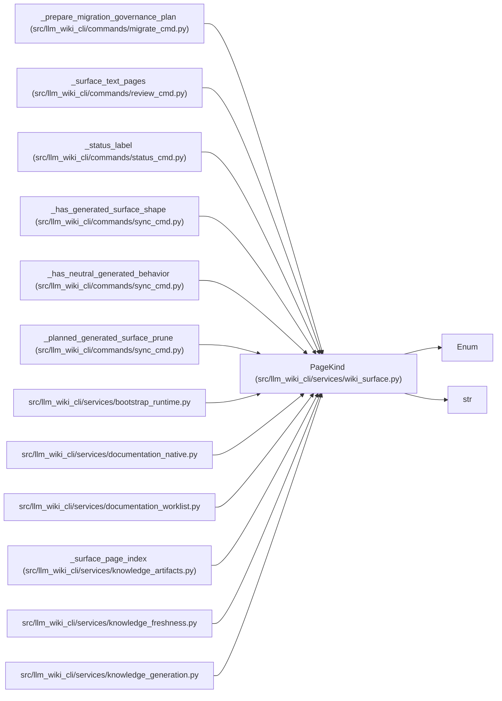

# PageKind

**Location:** `src/llm_wiki_cli/services/wiki_surface.py:41`
**Kind:** Enum
**Bases:** `str`, `Enum`
**Module:** [wiki_surface](../modules/wiki_surface.md)

## Description

_Auto-generated from `PageKind` in `src/llm_wiki_cli/services/wiki_surface.py`._

## Attributes

| Name | Declared value | Description |
|------|-------|-------------|
| `INDEX` | `'index'` | — |
| `LOG` | `'log'` | — |
| `ENTITIES` | `'entities'` | — |
| `MODULES` | `'modules'` | — |
| `WORKFLOWS` | `'workflows'` | — |
| `GUIDES` | `'guides'` | — |
| `FLOWS` | `'flows'` | — |
| `INFRASTRUCTURE` | `'infrastructure'` | — |
| `API_CONTRACTS` | `'api-contracts'` | — |
| `DEPENDENCIES` | `'dependencies'` | — |
| `LOAD_ORDER` | `'load-order'` | — |

## Methods

*No public methods. Inherits from base classes.*

## Relationships

<!-- Auto-generated relationship summary. Do not edit by hand. -->

### Summary

| Module | Methods | Attributes |
|---|---:|---|
| [wiki_surface](../modules/wiki_surface.md) | 0 | `API_CONTRACTS`, `DEPENDENCIES`, `ENTITIES`, `FLOWS`, `GUIDES`, `INDEX`, `INFRASTRUCTURE`, `LOAD_ORDER`, `LOG`, `MODULES`, `WORKFLOWS` |

### Structure

| Kind | Entity | Module |
|---|---|---|
| Base | `Enum` | — |
| Base | `str` | — |

### References

| Reference | Kind | Source | Call sites |
|---|---|---|---:|
| `_prepare_migration_governance_plan` | call | [migrate_cmd](../modules/migrate_cmd.md) | 3 |
| `_surface_text_pages` | type_reference | [review_cmd](../modules/review_cmd.md) | — |
| `_status_label` | type_reference | [status_cmd](../modules/status_cmd.md) | — |
| `_has_generated_surface_shape` | type_reference | [sync_cmd](../modules/sync_cmd.md) | — |
| `_has_neutral_generated_behavior` | type_reference | [sync_cmd](../modules/sync_cmd.md) | — |
| `_planned_generated_surface_prune` | call | [sync_cmd](../modules/sync_cmd.md) | 2 |
| `bootstrap_runtime` | import | [bootstrap_runtime](../modules/bootstrap_runtime.md) | — |
| `documentation_native` | import | [documentation_native](../modules/documentation_native.md) | — |
| `documentation_worklist` | import | [documentation_worklist](../modules/documentation_worklist.md) | — |
| `_surface_page_index` | call | [knowledge_artifacts](../modules/knowledge_artifacts.md) | 1 |
| `knowledge_freshness` | import | [knowledge_freshness](../modules/knowledge_freshness.md) | — |
| `knowledge_generation` | import | [knowledge_generation](../modules/knowledge_generation.md) | — |

> References: showing 12 of 33 logical references; 21 omitted by the 12-row generated summary limit.
