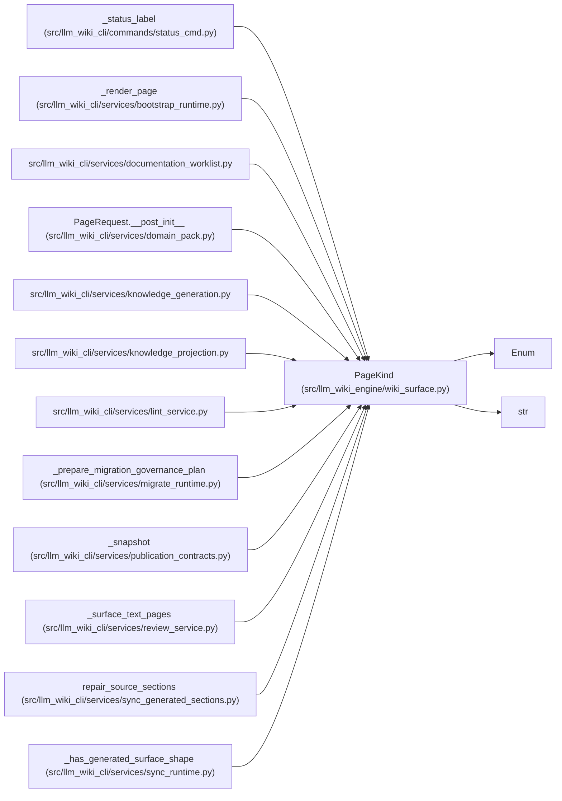

# PageKind

**Location:** `src/llm_wiki_engine/wiki_surface.py:41`
**Kind:** Enum
**Bases:** `str`, `Enum`
**Module:** [wiki_surface](../modules/wiki_surface.md)

## Description

_Auto-generated from `PageKind` in `src/llm_wiki_engine/wiki_surface.py`._

## Attributes

| Name | Declared value | Description |
|------|-------|-------------|
| `INDEX` | `'index'` | — |
| `LOG` | `'log'` | — |
| `ENTITIES` | `'entities'` | — |
| `MODULES` | `'modules'` | — |
| `WORKFLOWS` | `'workflows'` | — |
| `GUIDES` | `'guides'` | — |
| `FLOWS` | `'flows'` | — |
| `INFRASTRUCTURE` | `'infrastructure'` | — |
| `API_CONTRACTS` | `'api-contracts'` | — |
| `DEPENDENCIES` | `'dependencies'` | — |
| `LOAD_ORDER` | `'load-order'` | — |

## Methods

*No declared methods.*

## Relationships

<!-- Auto-generated relationship summary. Do not edit by hand. -->

```mermaid
flowchart LR
    n0["PageKind (src/llm_wiki_engine/wiki_surface.py)"]
    n1["Enum"]
    n2["str"]
    n3["_status_label (src/llm_wiki_cli/commands/status_cmd.py)"]
    n4["_render_page (src/llm_wiki_cli/services/bootstrap_runtime.py)"]
    n5["src/llm_wiki_cli/services/documentation_worklist.py"]
    n6["PageRequest.__post_init__ (src/llm_wiki_cli/services/domain_pack.py)"]
    n7["src/llm_wiki_cli/services/knowledge_generation.py"]
    n8["src/llm_wiki_cli/services/knowledge_projection.py"]
    n9["src/llm_wiki_cli/services/lint_service.py"]
    n10["_prepare_migration_governance_plan (src/llm_wiki_cli/services/migrate_runtime.py)"]
    n11["_snapshot (src/llm_wiki_cli/services/publication_contracts.py)"]
    n12["_surface_text_pages (src/llm_wiki_cli/services/review_service.py)"]
    n13["repair_source_sections (src/llm_wiki_cli/services/sync_generated_sections.py)"]
    n14["_has_generated_surface_shape (src/llm_wiki_cli/services/sync_runtime.py)"]
    n0 --> n1
    n0 --> n2
    n3 --> n0
    n4 --> n0
    n5 --> n0
    n6 --> n0
    n7 --> n0
    n8 --> n0
    n9 --> n0
    n10 --> n0
    n11 --> n0
    n12 --> n0
    n13 --> n0
    n14 --> n0
    click n0 "../modules/wiki_surface.md"
    click n3 "../modules/status_cmd.md"
    click n4 "../modules/bootstrap_runtime.md"
    click n5 "../modules/documentation_worklist.md"
    click n6 "../modules/domain_pack.md"
    click n7 "../modules/knowledge_generation.md"
    click n8 "../modules/knowledge_projection.md"
    click n9 "../modules/lint_service.md"
    click n10 "../modules/migrate_runtime.md"
    click n11 "../modules/publication_contracts.md"
    click n12 "../modules/review_service.md"
    click n13 "../modules/sync_generated_sections.md"
    click n14 "../modules/sync_runtime.md"
```

### Summary

| Module | Methods | Attributes |
|---|---:|---|
| [wiki_surface](../modules/wiki_surface.md) | 0 | `API_CONTRACTS`, `DEPENDENCIES`, `ENTITIES`, `FLOWS`, `GUIDES`, `INDEX`, `INFRASTRUCTURE`, `LOAD_ORDER`, `LOG`, `MODULES`, `WORKFLOWS` |

### Structure

| Kind | Entity | Module |
|---|---|---|
| Base | `Enum` | — |
| Base | `str` | — |

### References

| Reference | Kind | Source | Call sites |
|---|---|---|---:|
| `_status_label` | type_reference | [status_cmd](../modules/status_cmd.md) | — |
| `_render_page` | type_reference | [bootstrap_runtime](../modules/bootstrap_runtime.md) | — |
| `documentation_worklist` | import | [documentation_worklist](../modules/documentation_worklist.md) | — |
| `PageRequest.__post_init__` | call | [domain_pack](../modules/domain_pack.md) | 1 |
| `knowledge_generation` | import | [knowledge_generation](../modules/knowledge_generation.md) | — |
| `knowledge_projection` | import | [knowledge_projection](../modules/knowledge_projection.md) | — |
| `lint_service` | import | [lint_service](../modules/lint_service.md) | — |
| `_prepare_migration_governance_plan` | call | [migrate_runtime](../modules/migrate_runtime.md) | 3 |
| `_snapshot` | call | [publication_contracts](../modules/publication_contracts.md) | 1 |
| `_surface_text_pages` | type_reference | [review_service](../modules/review_service.md) | — |
| `repair_source_sections` | type_reference | [sync_generated_sections](../modules/sync_generated_sections.md) | — |
| `_has_generated_surface_shape` | type_reference | [sync_runtime](../modules/sync_runtime.md) | — |

> References: showing 12 of 40 logical references; 28 omitted by the 12-row generated summary limit.
