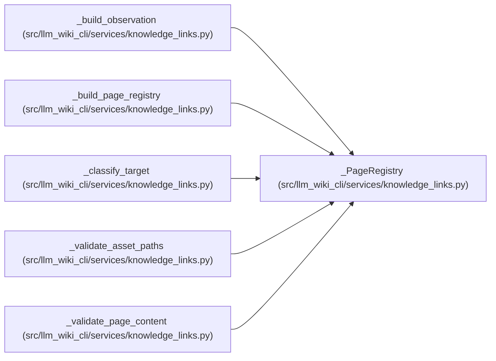

# _PageRegistry

**Location:** `src/llm_wiki_cli/services/knowledge_links.py:126`
**Kind:** Class
**Bases:** —
**Module:** [knowledge_links](../modules/knowledge_links.md)

**Decorators:** `@dataclass(frozen=True)`

## Description

_Auto-generated from `_PageRegistry` in `src/llm_wiki_cli/services/knowledge_links.py`._

## Attributes

| Name | Type | Default | Description |
|------|------|---------|-------------|
| `routes` | `Mapping[str, tuple[WikiSurfacePage, ...]]` | *required* | — |
| `locators` | `Mapping[str, tuple[WikiSurfacePage, ...]]` | *required* | — |

## Methods

*No public methods. Inherits from base classes.*

## Relationships

<!-- Auto-generated relationship summary. Do not edit by hand. -->

### Summary

| Module | Methods | Attributes |
|---|---:|---|
| [knowledge_links](../modules/knowledge_links.md) | 0 | `locators`, `routes` |

### References

| Reference | Kind | Source | Call sites |
|---|---|---|---:|
| `_build_observation` | type_reference | [knowledge_links](../modules/knowledge_links.md) | — |
| `_build_page_registry` | call | [knowledge_links](../modules/knowledge_links.md) | 1 |
| `_build_page_registry` | type_reference | [knowledge_links](../modules/knowledge_links.md) | — |
| `_classify_target` | type_reference | [knowledge_links](../modules/knowledge_links.md) | — |
| `_validate_asset_paths` | type_reference | [knowledge_links](../modules/knowledge_links.md) | — |
| `_validate_page_content` | type_reference | [knowledge_links](../modules/knowledge_links.md) | — |
