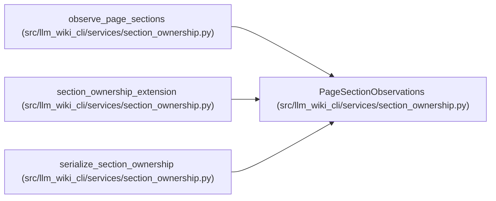

# PageSectionObservations

**Location:** `src/llm_wiki_cli/services/section_ownership.py:111`
**Kind:** Class
**Bases:** —
**Module:** [section_ownership](../modules/section_ownership.md)

**Decorators:** `@dataclass(frozen=True)`

## Description

All ordered section observations for one final Markdown page.

## Attributes

| Name | Type | Default | Description |
|------|------|---------|-------------|
| `page_locator` | `str` | *required* | — |
| `page_kind` | `PageKind` | *required* | — |
| `source_hash` | `str` | *required* | — |
| `exact_hash` | `str` | *required* | — |
| `ordering_hash` | `str` | *required* | — |
| `sections` | `tuple[SectionObservation, ...]` | *required* | — |

## Methods

| Method | Signature | Decorators | Description |
|--------|-----------|------------|-------------|
| `to_payload` | `() -> dict[str, object]` | — | — |

## Relationships

<!-- Auto-generated relationship summary. Do not edit by hand. -->

### Summary

| Module | Methods | Attributes |
|---|---:|---|
| [section_ownership](../modules/section_ownership.md) | 1 | `exact_hash`, `ordering_hash`, `page_kind`, `page_locator`, `sections`, `source_hash` |

### References

| Reference | Kind | Source |
|---|---|---|
| `observe_page_sections` | call | [section_ownership](../modules/section_ownership.md) |
| `observe_page_sections` | type_reference | [section_ownership](../modules/section_ownership.md) |
| `section_ownership_extension` | type_reference | [section_ownership](../modules/section_ownership.md) |
| `serialize_section_ownership` | type_reference | [section_ownership](../modules/section_ownership.md) |
