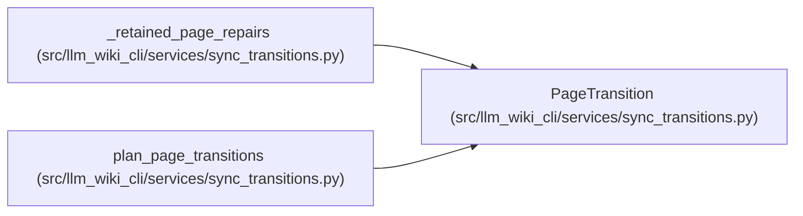

# PageTransition

**Location:** `src/llm_wiki_cli/services/sync_transitions.py:27`
**Kind:** Class
**Bases:** —
**Module:** [sync_transitions](../modules/sync_transitions.md)

**Decorators:** `@dataclass(frozen=True)`

## Description

_Auto-generated from `PageTransition` in `src/llm_wiki_cli/services/sync_transitions.py`._

## Attributes

| Name | Type | Default | Description |
|------|------|---------|-------------|
| `owner` | `ManifestPageSource` | *required* | — |
| `previous_owner` | `ManifestPageSource \| None` | *required* | — |
| `old_path` | `str \| None` | *required* | — |
| `source_path` | `str \| None` | *required* | — |
| `final_path` | `str` | *required* | — |
| `refresh_requested` | `bool` | *required* | — |

## Methods

| Method | Signature | Decorators | Description |
|--------|-----------|------------|-------------|
| `action` | `() -> str` | `@property` | — |
| `source_missing` | `() -> bool` | `@property` | — |

## Relationships

<!-- Auto-generated relationship summary. Do not edit by hand. -->

### Summary

| Module | Methods | Attributes |
|---|---:|---|
| [sync_transitions](../modules/sync_transitions.md) | 2 | `final_path`, `old_path`, `owner`, `previous_owner`, `refresh_requested`, `source_path` |

### References

| Reference | Kind | Source | Call sites |
|---|---|---|---:|
| `_retained_page_repairs` | type_reference | [sync_transitions](../modules/sync_transitions.md) | — |
| `plan_page_transitions` | call | [sync_transitions](../modules/sync_transitions.md) | 1 |
| `plan_page_transitions` | type_reference | [sync_transitions](../modules/sync_transitions.md) | — |
