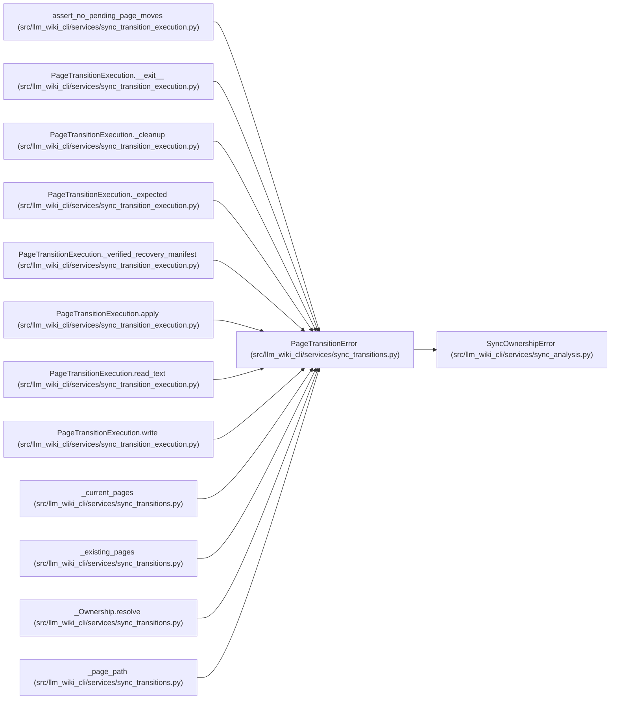

# PageTransitionError

**Location:** `src/llm_wiki_cli/services/sync_transitions.py:18`
**Kind:** Class
**Bases:** `SyncOwnershipError`
**Module:** [sync_transitions](../modules/sync_transitions.md)

## Description

The intended page writes cannot preserve verified ownership.

## Attributes

*No annotated attributes found.*

## Methods

*No public methods. Inherits from base classes.*

## Relationships

<!-- Auto-generated relationship summary. Do not edit by hand. -->

### Summary

| Module | Methods | Attributes |
|---|---:|---|
| [sync_transitions](../modules/sync_transitions.md) | 0 | — |

### Structure

| Kind | Entity | Module |
|---|---|---|
| Base | `SyncOwnershipError` | [sync_analysis](../modules/sync_analysis.md) |

### References

| Reference | Kind | Source | Call sites |
|---|---|---|---:|
| `assert_no_pending_page_moves` | call | [sync_transition_execution](../modules/sync_transition_execution.md) | 1 |
| `PageTransitionExecution.__exit__` | call | [sync_transition_execution](../modules/sync_transition_execution.md) | 1 |
| `PageTransitionExecution._cleanup` | call | [sync_transition_execution](../modules/sync_transition_execution.md) | 1 |
| `PageTransitionExecution._expected` | call | [sync_transition_execution](../modules/sync_transition_execution.md) | 1 |
| `PageTransitionExecution._verified_recovery_manifest` | call | [sync_transition_execution](../modules/sync_transition_execution.md) | 2 |
| `PageTransitionExecution.apply` | call | [sync_transition_execution](../modules/sync_transition_execution.md) | 2 |
| `PageTransitionExecution.read_text` | call | [sync_transition_execution](../modules/sync_transition_execution.md) | 3 |
| `PageTransitionExecution.write` | call | [sync_transition_execution](../modules/sync_transition_execution.md) | 1 |
| `_current_pages` | call | [sync_transitions](../modules/sync_transitions.md) | 3 |
| `_existing_pages` | call | [sync_transitions](../modules/sync_transitions.md) | 2 |
| `_Ownership.resolve` | call | [sync_transitions](../modules/sync_transitions.md) | 2 |
| `_page_path` | call | [sync_transitions](../modules/sync_transitions.md) | 1 |

> References: showing 12 of 15 logical references; 3 omitted by the 12-row generated summary limit.
