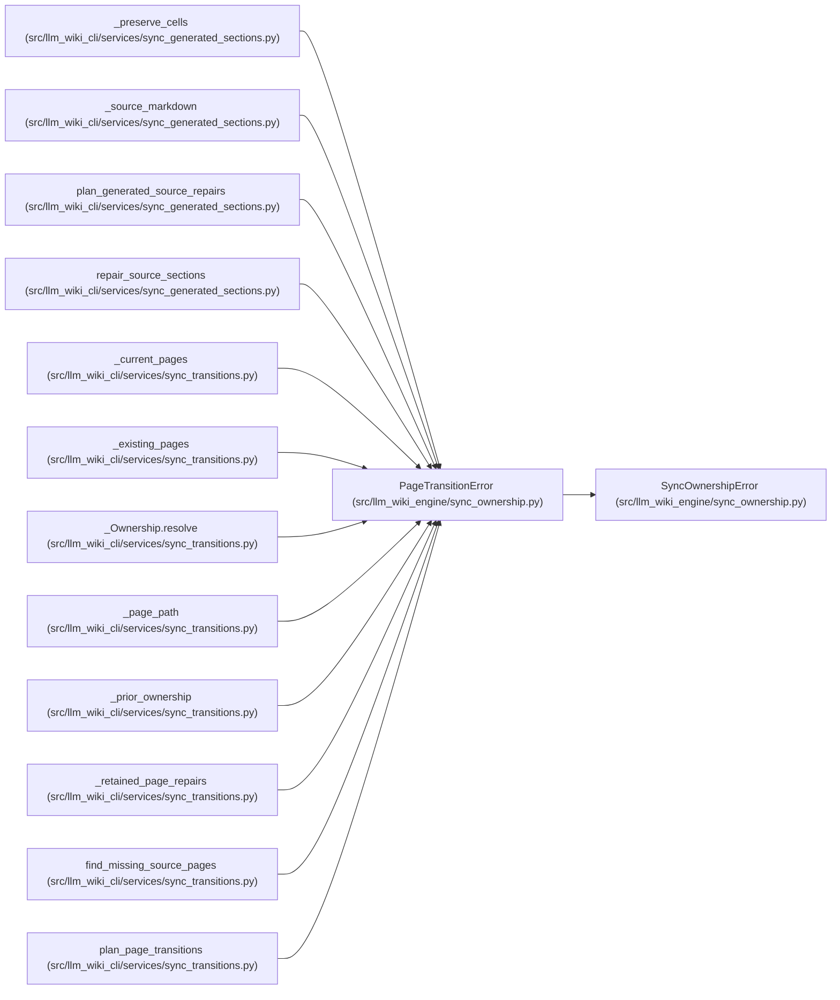

# PageTransitionError

**Location:** `src/llm_wiki_engine/sync_ownership.py:10`
**Kind:** Class
**Bases:** `SyncOwnershipError`
**Module:** [sync_ownership](../modules/sync_ownership.md)

## Description

The intended page writes cannot preserve verified ownership.

## Attributes

*No annotated attributes found.*

## Methods

*No declared methods.*

## Relationships

<!-- Auto-generated relationship summary. Do not edit by hand. -->

```mermaid
flowchart LR
    n0["PageTransitionError (src/llm_wiki_engine/sync_ownership.py)"]
    n1["SyncOwnershipError (src/llm_wiki_engine/sync_ownership.py)"]
    n2["_preserve_cells (src/llm_wiki_cli/services/sync_generated_sections.py)"]
    n3["_source_markdown (src/llm_wiki_cli/services/sync_generated_sections.py)"]
    n4["plan_generated_source_repairs (src/llm_wiki_cli/services/sync_generated_sections.py)"]
    n5["repair_source_sections (src/llm_wiki_cli/services/sync_generated_sections.py)"]
    n6["_current_pages (src/llm_wiki_cli/services/sync_transitions.py)"]
    n7["_existing_pages (src/llm_wiki_cli/services/sync_transitions.py)"]
    n8["_Ownership.resolve (src/llm_wiki_cli/services/sync_transitions.py)"]
    n9["_page_path (src/llm_wiki_cli/services/sync_transitions.py)"]
    n10["_prior_ownership (src/llm_wiki_cli/services/sync_transitions.py)"]
    n11["_retained_page_repairs (src/llm_wiki_cli/services/sync_transitions.py)"]
    n12["find_missing_source_pages (src/llm_wiki_cli/services/sync_transitions.py)"]
    n13["plan_page_transitions (src/llm_wiki_cli/services/sync_transitions.py)"]
    n0 --> n1
    n2 --> n0
    n3 --> n0
    n4 --> n0
    n5 --> n0
    n6 --> n0
    n7 --> n0
    n8 --> n0
    n9 --> n0
    n10 --> n0
    n11 --> n0
    n12 --> n0
    n13 --> n0
    click n0 "../modules/sync_ownership.md"
    click n1 "../modules/sync_ownership.md"
    click n2 "../modules/sync_generated_sections.md"
    click n3 "../modules/sync_generated_sections.md"
    click n4 "../modules/sync_generated_sections.md"
    click n5 "../modules/sync_generated_sections.md"
    click n6 "../modules/sync_transitions.md"
    click n7 "../modules/sync_transitions.md"
    click n8 "../modules/sync_transitions.md"
    click n9 "../modules/sync_transitions.md"
    click n10 "../modules/sync_transitions.md"
    click n11 "../modules/sync_transitions.md"
    click n12 "../modules/sync_transitions.md"
    click n13 "../modules/sync_transitions.md"
```

### Summary

| Module | Methods | Attributes |
|---|---:|---|
| [sync_ownership](../modules/sync_ownership.md) | 0 | — |

### Structure

| Kind | Entity | Module |
|---|---|---|
| Base | `SyncOwnershipError` | [sync_ownership](../modules/sync_ownership.md) |

### References

| Reference | Kind | Source | Call sites |
|---|---|---|---:|
| `_preserve_cells` | call | [sync_generated_sections](../modules/sync_generated_sections.md) | 2 |
| `_source_markdown` | call | [sync_generated_sections](../modules/sync_generated_sections.md) | 1 |
| `plan_generated_source_repairs` | call | [sync_generated_sections](../modules/sync_generated_sections.md) | 1 |
| `repair_source_sections` | call | [sync_generated_sections](../modules/sync_generated_sections.md) | 3 |
| `_current_pages` | call | [sync_transitions](../modules/sync_transitions.md) | 3 |
| `_existing_pages` | call | [sync_transitions](../modules/sync_transitions.md) | 2 |
| `_Ownership.resolve` | call | [sync_transitions](../modules/sync_transitions.md) | 2 |
| `_page_path` | call | [sync_transitions](../modules/sync_transitions.md) | 1 |
| `_prior_ownership` | call | [sync_transitions](../modules/sync_transitions.md) | 1 |
| `_retained_page_repairs` | call | [sync_transitions](../modules/sync_transitions.md) | 2 |
| `find_missing_source_pages` | call | [sync_transitions](../modules/sync_transitions.md) | 2 |
| `plan_page_transitions` | call | [sync_transitions](../modules/sync_transitions.md) | 9 |

> References: showing 12 of 20 logical references; 8 omitted by the 12-row generated summary limit.
