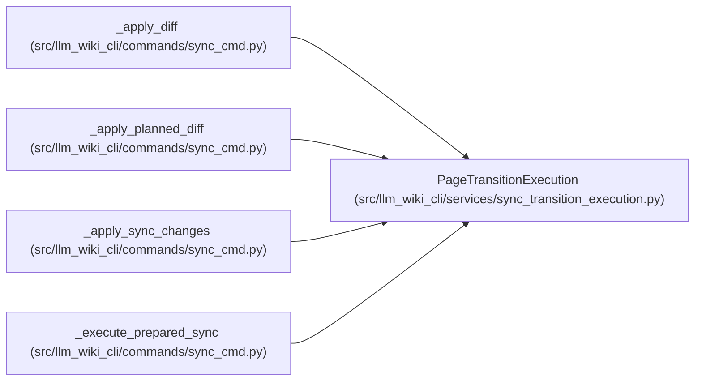

# PageTransitionExecution

**Location:** `src/llm_wiki_cli/services/sync_transition_execution.py:47`
**Kind:** Class
**Bases:** —
**Module:** [sync_transition_execution](../modules/sync_transition_execution.md)

## Description

Keep rename originals until the surrounding generation/commit succeeds.

This is a bounded page-move recovery boundary, not a wiki transaction. On
failure partial generated output is retained alongside durable originals;
subsequent sync refuses to guess ownership from that partial state.

## Attributes

*No annotated attributes found.*

## Methods

| Method | Signature | Decorators | Description |
|--------|-----------|------------|-------------|
| `__init__` | `(wiki_dir: Path, plan: PageTransitionPlan, *, preview: bool = False)` | — | — |
| `__enter__` | `()` | — | — |
| `__exit__` | `(exc_type, exc, traceback)` | — | — |
| `_journal` | `(state: str) -> None` | — | — |
| `_verified_recovery_manifest` | `()` | — | — |
| `_cleanup` | `() -> None` | — | — |
| `apply` | `(current_plan: PageTransitionPlan) -> None` | — | — |
| `_expected` | `(relative: str) -> bytes \| None` | — | — |
| `read_text` | `(relative: str) -> str \| None` | — | — |
| `write` | `(relative: str, text: str) -> str` | — | — |

## Relationships

<!-- Auto-generated relationship summary. Do not edit by hand. -->

### Summary

| Module | Methods | Attributes |
|---|---:|---|
| [sync_transition_execution](../modules/sync_transition_execution.md) | 10 | — |

### References

| Reference | Kind | Source | Call sites |
|---|---|---|---:|
| `_apply_diff` | type_reference | [sync_cmd](../modules/sync_cmd.md) | — |
| `_apply_planned_diff` | call | [sync_cmd](../modules/sync_cmd.md) | 1 |
| `_apply_sync_changes` | type_reference | [sync_cmd](../modules/sync_cmd.md) | — |
| `_execute_prepared_sync` | call | [sync_cmd](../modules/sync_cmd.md) | 1 |
